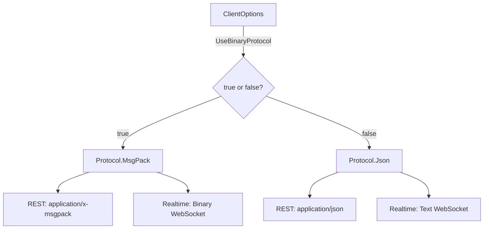
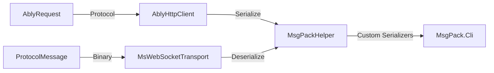

# MessagePack Implementation Plan for ably-dotnet

## Executive Summary

This document outlines the comprehensive implementation plan to add MessagePack (msgpack) support to the ably-dotnet SDK. The implementation will enable binary protocol support for improved performance and reduced bandwidth usage in REST and Realtime operations.

## Background

### Issue Context
- **GitHub Issue**: [#590 - Support MessagePack / MsgPack](https://github.com/ably/ably-dotnet/issues/590)
- **Previous PR**: [#494 - Reinstitute msgpack](https://github.com/ably/ably-dotnet/pull/494) (Closed without merging)

### Current State
The codebase already has partial msgpack infrastructure:
- `src/IO.Ably.Shared.MsgPack/` directory with serialization helpers
- Custom serializers for various Ably types
- Conditional compilation support via `#if MSGPACK` directives (needs removal)
- MsgPack.Cli library dependency (v0.9.2)
- Test fixtures in `common/test-resources/msgpack_test_fixtures.json`

### Key Requirements
1. **Remove all `#if MSGPACK` compilation directives** - msgpack should always be available
2. **Runtime protocol selection** via `ClientOptions.UseBinaryProtocol` property
3. Enable msgpack as the default protocol when `UseBinaryProtocol = true`
4. Update MsgPack.Cli library to stable version (v1.0.1)
5. Ensure backward compatibility with JSON protocol
6. Support msgpack in both REST and Realtime operations
7. Add comprehensive test coverage

---

## Architecture Overview

### Protocol Selection Flow



### Component Interaction



---

## Implementation Tasks

### 1. Build Configuration Updates

#### 1.1 Update Project Files
**Files to modify:**
- `src/IO.Ably.NETStandard20/IO.Ably.NETStandard20.csproj`
- `src/IO.Ably.NETFramework/IO.Ably.NETFramework.csproj`
- `src/IO.Ably.Android/IO.Ably.Android.csproj`
- `src/IO.Ably.iOS/IO.Ably.iOS.csproj`

**Changes required:**
```xml
<ItemGroup>
  <PackageReference Include="MsgPack.Cli" Version="1.0.1" />
</ItemGroup>
```

**Rationale:**
- **Remove MSGPACK compilation flag** - msgpack should always be available
- Update to stable MsgPack.Cli version (v1.0.1)
- MsgPack.Cli becomes a standard dependency, not optional

#### 1.2 Update Shared Project References
**Files to modify:**
- `src/IO.Ably.NETStandard20/IO.Ably.NETStandard20.csproj`
- Other platform-specific projects

**Current state (line 37):**
```xml
<Import Project="..\IO.Ably.Shared.MsgPack\IO.Ably.Shared.MsgPack.projitems" Label="Shared" Condition="$(DefineConstants.Contains(MSGPACK))" />
```

**Changes required:**
```xml
<!-- Always include MsgPack project - no conditional compilation -->
<Import Project="..\IO.Ably.Shared.MsgPack\IO.Ably.Shared.MsgPack.projitems" Label="Shared" />
```

**Rationale:** MsgPack support should always be compiled in, with runtime selection via `UseBinaryProtocol`.

---

### 2. Core Protocol Implementation

#### 2.1 Update Defaults.cs
**File:** `src/IO.Ably.Shared/Defaults.cs`

**Current state (lines 65-72):**
```csharp
#if MSGPACK
        internal const Protocol DefaultProtocol = IO.Ably.Protocol.MsgPack;
        internal const bool MsgPackEnabled = true;
#else
        internal const Protocol Protocol = IO.Ably.Protocol.Json;
        internal const bool MsgPackEnabled = false;
#endif
```

**Changes required:**
- **Remove all `#if MSGPACK` directives**
- MsgPack is always enabled, protocol selection is runtime-based
- Default protocol should be MsgPack (as per Ably spec)

**Updated code:**
```csharp
// MsgPack is always available - protocol selection is runtime-based via ClientOptions.UseBinaryProtocol
internal const Protocol DefaultProtocol = IO.Ably.Protocol.MsgPack;
internal const bool MsgPackEnabled = true;
```

**Rationale:**
- Simplifies codebase by removing conditional compilation
- Protocol selection happens at runtime via `ClientOptions.UseBinaryProtocol`
- MsgPack becomes the default for better performance

#### 2.2 Update Protocol Enum
**File:** `src/IO.Ably.Shared/Protocol.cs`

**Current state:**
```csharp
public enum Protocol
{
#if MSGPACK
    MsgPack = 0,
#endif
    Json = 1
}
```

**Changes required:**
- **Remove `#if MSGPACK` directive**
- Both protocols should always be available

**Updated code:**
```csharp
public enum Protocol
{
    /// <summary>
    /// MessagePack binary protocol (default for better performance)
    /// </summary>
    MsgPack = 0,
    
    /// <summary>
    /// JSON text protocol
    /// </summary>
    Json = 1
}
```

**Rationale:** Both protocols are always available, selection is made at runtime.

---

### 3. HTTP Client Updates

#### 3.1 Update AblyRequest.cs
**File:** `src/IO.Ably.Shared/Http/AblyRequest.cs`

**Current state (line 11):**
```csharp
public AblyRequest(string path, HttpMethod method, Protocol protocol = Defaults.Protocol)
```

**Issue:** References `Defaults.Protocol` which doesn't exist in non-MSGPACK builds

**Fix required:**
```csharp
public AblyRequest(string path, HttpMethod method, Protocol protocol = Defaults.DefaultProtocol)
```

#### 3.2 Update AblyHttpClient.cs
**File:** `src/IO.Ably.Shared/Http/AblyHttpClient.cs`

**Current implementation (lines 395-401):**
```csharp
#if MSGPACK
            if(request.Protocol == Protocol.MsgPack)
                message.Headers.Accept.Add(new MediaTypeWithQualityHeaderValue(GetHeaderValue(request.Protocol)));
#endif

            // Always accept JSON
            message.Headers.Accept.Add(new MediaTypeWithQualityHeaderValue(GetHeaderValue(Protocol.Json)));
```

**Changes required:**
1. **Remove `#if MSGPACK` directive**
2. Add proper content-type header for request body when using msgpack
3. Ensure Accept header prioritizes msgpack when UseBinaryProtocol is true
4. Add serialization/deserialization logic for msgpack payloads

**Updated implementation:**
```csharp
private HttpRequestMessage GetRequestMessage(AblyRequest request, string host)
{
    var message = new HttpRequestMessage(request.Method, GetRequestUrl(request, host));

    foreach (var header in request.Headers)
    {
        message.Headers.TryAddWithoutValidation(header.Key, header.Value);
    }

    // Set Accept headers based on protocol preference
    if(request.Protocol == Protocol.MsgPack)
    {
        // Prefer msgpack but accept JSON as fallback
        message.Headers.Accept.Add(new MediaTypeWithQualityHeaderValue(GetHeaderValue(Protocol.MsgPack), 1.0));
        message.Headers.Accept.Add(new MediaTypeWithQualityHeaderValue(GetHeaderValue(Protocol.Json), 0.9));
    }
    else
    {
        // Prefer JSON
        message.Headers.Accept.Add(new MediaTypeWithQualityHeaderValue(GetHeaderValue(Protocol.Json)));
    }

    if (message.Method == HttpMethod.Post || message.Method == HttpMethod.Put)
    {
        if (request.PostParameters.Any() && request.RequestBody.Length == 0)
        {
            message.Content = new FormUrlEncodedContent(request.PostParameters);
        }
        else
        {
            var content = new ByteArrayContent(request.RequestBody);
            content.Headers.ContentType = new MediaTypeHeaderValue(GetHeaderValue(request.Protocol));
            message.Content = content;
        }
    }

    return message;
}
```

**Rationale:** No conditional compilation - protocol selection is purely runtime-based.

#### 3.3 Add Request Body Serialization
**File:** `src/IO.Ably.Shared/Http/AblyHttpClient.cs` or new helper class

**New method needed:**
```csharp
internal static byte[] SerializeRequestBody(object data, Protocol protocol)
{
    // Runtime protocol selection - no conditional compilation
    if (protocol == Protocol.MsgPack)
    {
        return MsgPackHelper.Serialise(data);
    }
    
    return Encoding.UTF8.GetBytes(JsonHelper.Serialize(data));
}
```

**Rationale:** Simple runtime check, no `#if MSGPACK` needed.

---

### 4. WebSocket/Realtime Protocol Updates

#### 4.1 Update TransportParams
**File:** `src/IO.Ably.Shared/Transport/TransportParams.cs`

**Verification needed:**
- Ensure `UseBinaryProtocol` property correctly maps to msgpack usage
- Verify WebSocket URI includes appropriate format parameter

**Expected behavior:**
- When `UseBinaryProtocol = true` and MSGPACK is enabled, use `format=msgpack`
- Otherwise use `format=json`

#### 4.2 Update MsWebSocketTransport
**File:** `src/IO.Ably.Shared/Transport/MsWebSocketTransport.cs`

**Current implementation (lines 172-180):**
```csharp
#if MSGPACK
    var message = MsgPackHelper.DeserialiseMsgPackObject(data.Data).ToString();
    Logger.Debug("Websocket data message received. Raw: " + message);
#endif
```

**Changes required:**
- **Remove `#if MSGPACK` directive**
- Always support msgpack deserialization when binary data is received

**Updated implementation:**
```csharp
private void HandleMessageReceived(RealtimeTransportData data)
{
    if (data.IsBinary)
    {
        if (Logger.IsDebug)
        {
            try
            {
                // Always available - no conditional compilation
                var message = MsgPackHelper.DeserialiseMsgPackObject(data.Data).ToString();
                Logger.Debug("Websocket data message received. Raw: " + message);
            }
            catch (Exception)
            {
                Logger.Debug("Error parsing message as MsgPack.");
            }
        }

        Listener?.OnTransportDataReceived(data);
    }
    else
    {
        if (Logger.IsDebug)
        {
            Logger.Debug("Websocket message received. Raw: " + data.Text);
        }

        Listener?.OnTransportDataReceived(data);
    }
}
```

**Rationale:** MsgPack deserialization is always available, used when binary data is received.

#### 4.3 Update ProtocolMessage Serialization
**File:** `src/IO.Ably.Shared/Types/ProtocolMessage.cs`

**Changes required:**
- Ensure ProtocolMessage can be serialized/deserialized via msgpack
- Verify all custom serializers in `src/IO.Ably.Shared.MsgPack/CustomSerialisers/` are up to date

---

### 5. Message Encoding/Decoding

#### 5.1 Update MessageHandler
**File:** `src/IO.Ably.Shared/MessageEncoders/MessageHandler.cs`

**Changes required:**
- Ensure message encoding/decoding works with msgpack protocol
- Verify base64, json, and cipher encoders work correctly with msgpack

#### 5.2 Update Message and PresenceMessage
**Files:**
- `src/IO.Ably.Shared/Types/Message.cs`
- `src/IO.Ably.Shared/Types/PresenceMessage.cs`

**Verification needed:**
- Ensure FromEncoded methods work with msgpack-encoded messages
- Test message data types (string, binary, JSON objects) with msgpack

---

### 6. Custom Serializers Update

#### 6.1 Review Existing Serializers
**Directory:** `src/IO.Ably.Shared.MsgPack/CustomSerialisers/`

**Files to review:**
- `CapabilityMessagePackSerializer.cs`
- `DateTimeOffsetMessagePackSerializer.cs`
- `TimespanMessagePackSerializer.cs`
- All generated serializers in `GeneratedSerializers/` subdirectory

**Tasks:**
1. Verify all serializers are compatible with MsgPack.Cli v1.0.1
2. Test serialization/deserialization round-trips
3. Ensure null handling is correct
4. Verify enum serialization

#### 6.2 Add Missing Serializers
**Analysis needed:**
- Compare types used in REST/Realtime operations with existing serializers
- Identify any missing custom serializers
- Generate new serializers as needed

**Potential missing serializers:**
- `ChannelOptions`
- `ChannelParams`
- `MessageExtras`
- `DeltaExtras`

---

### 7. REST API Updates

#### 7.1 Update AblyRest
**File:** `src/IO.Ably.Shared/AblyRest.cs`

**Changes required:**
- Ensure all REST methods respect the Protocol setting from `ClientOptions.UseBinaryProtocol`
- Verify request body serialization uses correct protocol
- Test response deserialization with msgpack responses
- **Remove any `#if MSGPACK` directives**

**Protocol determination:**
```csharp
// Determine protocol from ClientOptions
private Protocol GetProtocol()
{
    return Options.UseBinaryProtocol ? Protocol.MsgPack : Protocol.Json;
}
```

**Methods to update:**
- `Request()` - Generic REST request method
- Channel operations (publish, history, presence)
- Stats operations
- Auth operations (token requests)

**Rationale:** Protocol selection is based on `ClientOptions.UseBinaryProtocol`, not compilation flags.

#### 7.2 Update RestChannel
**File:** `src/IO.Ably.Shared/Rest/RestChannel.cs`

**Changes required:**
- Ensure `PublishAsync()` serializes messages using correct protocol
- Verify `HistoryAsync()` deserializes responses correctly
- Test presence operations with msgpack

---

### 8. Realtime API Updates

#### 8.1 Update AblyRealtime
**File:** `src/IO.Ably.Shared/AblyRealtime.cs`

**Changes required:**
- Ensure connection uses binary protocol when `UseBinaryProtocol = true`
- Verify protocol messages are serialized/deserialized correctly

#### 8.2 Update ConnectionManager
**File:** `src/IO.Ably.Shared/Transport/ConnectionManager.cs`

**Changes required:**
- Ensure ProtocolMessage serialization uses msgpack when binary protocol is enabled
- Verify message acknowledgments work with msgpack
- Test connection state recovery with msgpack

#### 8.3 Update RealtimeChannel
**File:** `src/IO.Ably.Shared/Realtime/RealtimeChannel.cs`

**Changes required:**
- Ensure channel attach/detach messages use correct protocol
- Verify message publishing uses msgpack when enabled
- Test presence operations with msgpack

---

### 9. Testing Strategy

#### 9.1 Unit Tests

**New test files to create:**
- `src/IO.Ably.Tests.Shared/MsgPack/MsgPackSerializationTests.cs`
- `src/IO.Ably.Tests.Shared/MsgPack/MsgPackProtocolMessageTests.cs`
- `src/IO.Ably.Tests.Shared/MsgPack/MsgPackMessageEncodingTests.cs`

**Test coverage required:**
1. **Serialization Tests**
   - Test all Ably types can be serialized to msgpack
   - Test deserialization from msgpack
   - Test round-trip serialization
   - Test null handling
   - Test edge cases (empty arrays, large numbers, etc.)

2. **Protocol Message Tests**
   - Test ProtocolMessage serialization/deserialization
   - Test all message actions (ATTACH, DETACH, MESSAGE, PRESENCE, etc.)
   - Test message flags
   - Test connection details
   - Test error messages

3. **Message Encoding Tests**
   - Test message data encoding (string, binary, JSON)
   - Test message encoding chain (json/utf8/cipher/base64)
   - Test presence message encoding
   - Test message extras

4. **HTTP Client Tests**
   - Test REST requests with msgpack protocol
   - Test response deserialization
   - Test content-type negotiation
   - Test fallback to JSON

5. **WebSocket Tests**
   - Test binary WebSocket messages
   - Test message framing
   - Test large messages
   - Test connection recovery

#### 9.2 Integration Tests

**Test scenarios:**
1. **REST API Tests**
   - Publish messages via REST with msgpack
   - Retrieve message history with msgpack
   - Retrieve presence with msgpack
   - Retrieve stats with msgpack
   - Test token authentication with msgpack

2. **Realtime API Tests**
   - Connect with binary protocol
   - Publish/subscribe messages
   - Presence operations
   - Channel attach/detach
   - Connection state recovery
   - Message acknowledgments

3. **Cross-Protocol Tests**
   - Publish with msgpack, receive with JSON
   - Publish with JSON, receive with msgpack
   - Test protocol negotiation

#### 9.3 Test Fixtures

**File:** `common/test-resources/msgpack_test_fixtures.json`

**Current fixtures:**
- JSON array
- Short string (1 char)
- 200 character string
- 2000 character string
- Short binary
- 200 byte binary
- 2000 byte binary
- JSON object

**Additional fixtures needed:**
- ProtocolMessage examples
- Message with extras
- Presence messages
- Error messages
- Stats objects
- Token requests/responses

#### 9.4 Compatibility Tests

**Test matrix:**
| Client Protocol | Server Protocol | Expected Result |
|----------------|-----------------|-----------------|
| MsgPack        | MsgPack         | ✓ Success       |
| MsgPack        | JSON            | ✓ Success       |
| JSON           | MsgPack         | ✓ Success       |
| JSON           | JSON            | ✓ Success       |

---

### 10. Documentation Updates

#### 10.1 README.md
**File:** `README.md`

**Additions needed:**
```markdown
### Binary Protocol (MessagePack)

The SDK supports MessagePack binary protocol for improved performance and reduced bandwidth usage.

To enable binary protocol:

```csharp
var options = new ClientOptions("your-api-key")
{
    UseBinaryProtocol = true
};
var client = new AblyRealtime(options);
```

**Benefits:**
- Reduced message size (typically 20-30% smaller than JSON)
- Faster serialization/deserialization
- Lower bandwidth usage

**Note:** Binary protocol is enabled by default in builds with MSGPACK support.
```

#### 10.2 API Documentation
**Files to update:**
- XML documentation comments in `ClientOptions.cs`
- XML documentation comments in `Protocol.cs`
- XML documentation comments in `AblyRequest.cs`

**Example:**
```csharp
/// <summary>
/// If false, forces the library to use the JSON encoding for REST and Realtime operations.
/// If true, the MsgPack binary format is used (if available in the current build).
/// Binary protocol typically results in 20-30% smaller message sizes and faster serialization.
/// Default: true (when MSGPACK is enabled), false (otherwise).
/// </summary>
public bool UseBinaryProtocol { get; set; }
```

#### 10.3 CHANGELOG.md
**File:** `CHANGELOG.md`

**Entry to add:**
```markdown
## [Version X.X.X] - YYYY-MM-DD

### Added
- MessagePack binary protocol support for REST and Realtime operations
- `UseBinaryProtocol` option in `ClientOptions` to enable/disable binary protocol
- Automatic content-type negotiation for REST requests
- Binary WebSocket support for Realtime connections

### Changed
- Updated MsgPack.Cli dependency to v1.0.1 (stable)
- Default protocol is now MessagePack when `UseBinaryProtocol = true`

### Fixed
- Fixed protocol selection logic in `AblyRequest` constructor
- Fixed `Defaults.Protocol` naming inconsistency
```

---

### 11. Performance Considerations

#### 11.1 Benchmarking
**Create benchmark project:**
- `src/IO.Ably.Benchmarks/IO.Ably.Benchmarks.csproj`

**Benchmarks to implement:**
1. Message serialization (JSON vs MsgPack)
2. Message deserialization (JSON vs MsgPack)
3. Large message handling
4. Array serialization
5. ProtocolMessage serialization

**Expected results:**
- MsgPack should be 2-3x faster for serialization
- MsgPack should be 1.5-2x faster for deserialization
- MsgPack should produce 20-30% smaller payloads

#### 11.2 Memory Usage
**Monitoring needed:**
- Memory allocation during serialization
- Memory allocation during deserialization
- GC pressure comparison (JSON vs MsgPack)

---

### 12. Migration Guide

#### 12.1 For Existing Users
**Document:** `docs/MSGPACK_MIGRATION.md`

**Content:**
```markdown
# MessagePack Migration Guide

## Overview
Starting from version X.X.X, ably-dotnet supports MessagePack binary protocol.

## Breaking Changes
None. JSON protocol remains the default for backward compatibility.

## Opt-in to Binary Protocol
To enable MessagePack:

```csharp
var options = new ClientOptions("your-api-key")
{
    UseBinaryProtocol = true
};
```

## Compatibility
- Binary protocol is fully compatible with JSON protocol
- Clients using different protocols can communicate seamlessly
- Server automatically handles protocol negotiation

## Performance Impact
- Expect 20-30% reduction in bandwidth usage
- Expect 2-3x faster serialization
- Minimal impact on CPU usage

## Troubleshooting
If you experience issues with binary protocol:
1. Verify MSGPACK build flag is enabled
2. Check MsgPack.Cli version (should be 1.0.1+)
3. Enable debug logging to inspect protocol messages
4. Fall back to JSON protocol if needed
```

---

### 13. Build and Release Process

#### 13.1 NuGet Package Updates
**File:** `nuget/io.ably.nuspec`

**Changes required:**
- Update version number
- Add release notes about msgpack support
- Verify MsgPack.Cli dependency is included

#### 13.2 CI/CD Updates
**Files to update:**
- `.github/workflows/*.yml`
- `common/.github/workflows/check.yml`

**Changes required:**
- Ensure MSGPACK flag is set in CI builds
- Add msgpack-specific test runs
- Verify package includes msgpack assemblies

#### 13.3 Platform-Specific Builds
**Platforms to verify:**
- .NET Standard 2.0
- .NET 6.0
- .NET 7.0
- .NET Framework 4.6.2+
- Xamarin.Android
- Xamarin.iOS
- Unity
- MAUI

**Verification checklist:**
- [ ] MsgPack.Cli is included in all packages (always, not conditional)
- [ ] Binary protocol works on all platforms
- [ ] No platform-specific issues
- [ ] Runtime protocol selection works correctly
- [ ] No `#if MSGPACK` directives remain in codebase

---

### 14. Rollout Strategy

#### 14.1 Phase 1: Internal Testing (Week 1-2)
- Remove all `#if MSGPACK` compilation directives
- Ensure MsgPack.Cli is always included
- Run full test suite with both protocols
- Perform manual testing
- Benchmark performance
- Fix any issues found

#### 14.2 Phase 2: Beta Release (Week 3-4)
- Release beta NuGet package
- Gather feedback from early adopters
- Monitor for issues
- Iterate based on feedback

#### 14.3 Phase 3: Production Release (Week 5-6)
- Release stable version
- Update documentation
- Announce release
- Monitor adoption and issues

---

### 15. Risk Assessment and Mitigation

#### 15.1 Risks

| Risk | Impact | Probability | Mitigation |
|------|--------|-------------|------------|
| MsgPack.Cli compatibility issues | High | Low | Thorough testing, version pinning |
| Performance regression | Medium | Low | Benchmarking, performance tests |
| Breaking changes | High | Low | MsgPack is default but JSON remains available |
| Platform-specific issues | Medium | Medium | Test on all platforms, CI/CD coverage |
| Serialization bugs | High | Medium | Comprehensive unit tests, integration tests |
| Increased package size | Low | High | MsgPack.Cli adds ~200KB, acceptable tradeoff |

#### 15.2 Rollback Plan
If critical issues are discovered:
1. Release hotfix with `UseBinaryProtocol` defaulting to `false`
2. Investigate and fix issues
3. Re-enable MsgPack as default in next release
4. MsgPack.Cli remains in package but unused if `UseBinaryProtocol = false`

---

### 16. Success Criteria

#### 16.1 Functional Requirements
- [ ] Binary protocol works for all REST operations
- [ ] Binary protocol works for all Realtime operations
- [ ] Backward compatibility with JSON protocol maintained
- [ ] All existing tests pass with msgpack enabled
- [ ] New msgpack-specific tests pass

#### 16.2 Performance Requirements
- [ ] Message serialization is at least 2x faster with msgpack
- [ ] Message size is at least 20% smaller with msgpack
- [ ] No significant increase in memory usage
- [ ] No regression in JSON protocol performance

#### 16.3 Quality Requirements
- [ ] Code coverage > 80% for msgpack code
- [ ] No critical or high-severity bugs
- [ ] Documentation is complete and accurate
- [ ] All platforms supported

---

## Implementation Timeline

### Week 1-2: Foundation
- [ ] Remove all `#if MSGPACK` compilation directives from codebase
- [ ] Update MsgPack.Cli to v1.0.1 (always included)
- [ ] Update project files to always include MsgPack project
- [ ] Fix Defaults.cs and Protocol.cs (remove conditionals)
- [ ] Update AblyRequest.cs for runtime protocol selection

### Week 3-4: Core Implementation
- [ ] Update HTTP client (remove `#if MSGPACK` directives)
- [ ] Update WebSocket transport (remove `#if MSGPACK` directives)
- [ ] Update message encoding/decoding for runtime protocol selection
- [ ] Review and update custom serializers
- [ ] Implement REST API changes with runtime protocol selection

### Week 5-6: Realtime Implementation
- [ ] Update Realtime API (remove any remaining `#if MSGPACK`)
- [ ] Update ConnectionManager for runtime protocol selection
- [ ] Update RealtimeChannel for runtime protocol selection
- [ ] Test connection state recovery with both protocols
- [ ] Verify protocol switching works correctly

### Week 7-8: Testing
- [ ] Write unit tests for msgpack serialization (always available)
- [ ] Write integration tests for both protocols
- [ ] Test runtime protocol switching
- [ ] Implement test fixtures
- [ ] Run compatibility tests (JSON ↔ MsgPack)
- [ ] Performance benchmarking (JSON vs MsgPack)
- [ ] Verify no `#if MSGPACK` directives remain

### Week 9-10: Documentation and Release
- [ ] Update README.md
- [ ] Update API documentation
- [ ] Write migration guide
- [ ] Update CHANGELOG.md
- [ ] Prepare NuGet package
- [ ] Beta release and testing
- [ ] Production release

---

## Appendix

### A. Key Files Reference

#### Core Protocol Files
- [`src/IO.Ably.Shared/Protocol.cs`](src/IO.Ably.Shared/Protocol.cs) - Protocol enum definition
- [`src/IO.Ably.Shared/Defaults.cs`](src/IO.Ably.Shared/Defaults.cs) - Default protocol configuration
- [`src/IO.Ably.Shared/ClientOptions.cs`](src/IO.Ably.Shared/ClientOptions.cs) - Client configuration

#### HTTP/REST Files
- [`src/IO.Ably.Shared/Http/AblyHttpClient.cs`](src/IO.Ably.Shared/Http/AblyHttpClient.cs) - HTTP client implementation
- [`src/IO.Ably.Shared/Http/AblyRequest.cs`](src/IO.Ably.Shared/Http/AblyRequest.cs) - Request wrapper
- [`src/IO.Ably.Shared/AblyRest.cs`](src/IO.Ably.Shared/AblyRest.cs) - REST API implementation

#### WebSocket/Realtime Files
- [`src/IO.Ably.Shared/Transport/MsWebSocketTransport.cs`](src/IO.Ably.Shared/Transport/MsWebSocketTransport.cs) - WebSocket transport
- [`src/IO.Ably.Shared/Transport/ConnectionManager.cs`](src/IO.Ably.Shared/Transport/ConnectionManager.cs) - Connection management
- [`src/IO.Ably.Shared/AblyRealtime.cs`](src/IO.Ably.Shared/AblyRealtime.cs) - Realtime API implementation

#### Serialization Files
- [`src/IO.Ably.Shared.MsgPack/MsgPackHelper.cs`](src/IO.Ably.Shared.MsgPack/MsgPackHelper.cs) - MsgPack serialization helper
- [`src/IO.Ably.Shared.MsgPack/CustomSerialisers/`](src/IO.Ably.Shared.MsgPack/CustomSerialisers/) - Custom serializers directory

#### Message Files
- [`src/IO.Ably.Shared/Types/Message.cs`](src/IO.Ably.Shared/Types/Message.cs) - Message type
- [`src/IO.Ably.Shared/Types/ProtocolMessage.cs`](src/IO.Ably.Shared/Types/ProtocolMessage.cs) - Protocol message type
- [`src/IO.Ably.Shared/MessageEncoders/MessageHandler.cs`](src/IO.Ably.Shared/MessageEncoders/MessageHandler.cs) - Message encoding

#### Test Files
- [`src/IO.Ably.Tests.Shared/MsgPackMessageSerializerTests.cs`](src/IO.Ably.Tests.Shared/MsgPackMessageSerializerTests.cs) - Serialization tests
- [`src/IO.Ably.Tests.Shared/MessagePack/SerializationTests.cs`](src/IO.Ably.Tests.Shared/MessagePack/SerializationTests.cs) - Additional tests
- [`common/test-resources/msgpack_test_fixtures.json`](common/test-resources/msgpack_test_fixtures.json) - Test fixtures

### B. Dependencies

#### NuGet Packages
- **MsgPack.Cli** v1.0.1 (upgrade from v0.9.2)
  - Purpose: MessagePack serialization library
  - License: Apache 2.0
  - Repository: https://github.com/msgpack/msgpack-cli

- **Newtonsoft.Json** v13.0.1 (existing)
  - Purpose: JSON serialization (fallback)
  - License: MIT

### C. Useful Commands

#### Build (MsgPack always included)
```bash
# Standard build - MsgPack is always available
dotnet build

# Release build
dotnet build -c Release
```

#### Run tests
```bash
# Run all tests (includes both JSON and MsgPack tests)
dotnet test

# Run only MsgPack-specific tests
dotnet test --filter "Category=MsgPack"

# Run protocol compatibility tests
dotnet test --filter "Category=ProtocolCompatibility"
```

#### Create NuGet package
```bash
# MsgPack.Cli is always included as a dependency
dotnet pack -c Release
```

#### Test with specific protocol
```csharp
// In test code - force specific protocol
var options = new ClientOptions("key") { UseBinaryProtocol = true };  // MsgPack
var options = new ClientOptions("key") { UseBinaryProtocol = false }; // JSON
```

### D. References

- [Ably Protocol Specification](https://sdk.ably.com/builds/ably/specification/main/features/)
- [MessagePack Specification](https://msgpack.org/index.html)
- [MsgPack.Cli Documentation](https://github.com/msgpack/msgpack-cli/wiki)
- [GitHub Issue #590](https://github.com/ably/ably-dotnet/issues/590)
- [GitHub PR #494](https://github.com/ably/ably-dotnet/pull/494)
- [Ably .NET SDK Documentation](https://ably.com/docs/sdk/dotnet)

### E. Contact and Support

For questions or issues during implementation:
- GitHub Issues: https://github.com/ably/ably-dotnet/issues
- Ably Support: https://ably.com/support
- Internal Team: Check MAINTAINERS.md

---

**Document Version**: 1.0  
**Created**: 2025-10-20  
**Last Updated**: 2025-10-20  
**Author**: Roo (Architect Mode)  
**Status**: Ready for Review
