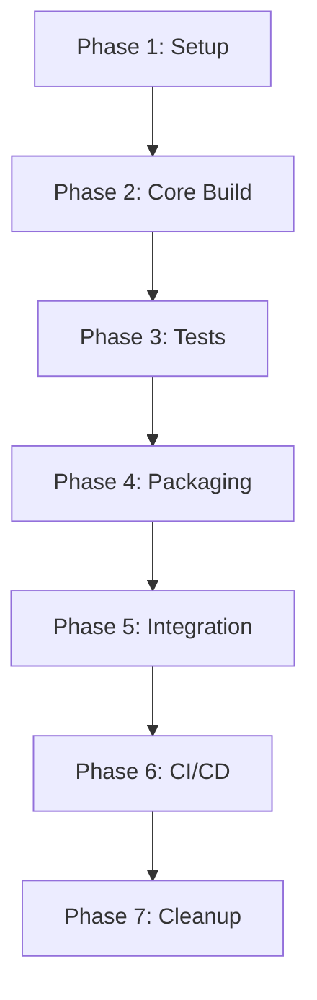

# Build System Migration Plan: FAKE to Cake Build

## Executive Summary

This document outlines the step-by-step migration plan from FAKE (F#) build system to Cake Build (C#) for the ably-dotnet SDK. The migration aims to maintain all existing build commands and functionality while making the build system more accessible to C# developers.

**Current State:** FAKE 5.23.1 with F# build scripts  
**Target State:** Cake Build 4.0+ with C# build scripts  
**Migration Approach:** Parallel implementation with gradual cutover

**Reference:** [GitHub Issue #1258](https://github.com/ably/ably-dotnet/issues/1258)

---

## Table of Contents

1. [Current Build System Analysis](#1-current-build-system-analysis)
2. [Migration Strategy](#2-migration-strategy)
3. [Prerequisites](#3-prerequisites)
4. [Phase 1: Setup and Preparation](#phase-1-setup-and-preparation)
5. [Phase 2: Core Build Tasks Migration](#phase-2-core-build-tasks-migration)
6. [Phase 3: Test Tasks Migration](#phase-3-test-tasks-migration)
7. [Phase 4: Package Tasks Migration](#phase-4-package-tasks-migration)
8. [Phase 5: Integration and Testing](#phase-5-integration-and-testing)
9. [Phase 6: CI/CD Migration](#phase-6-cicd-migration)
10. [Phase 7: Cleanup and Documentation](#phase-7-cleanup-and-documentation)
11. [Rollback Plan](#rollback-plan)
12. [Success Criteria](#success-criteria)
13. [Appendices](#appendices)

---

## 1. Current Build System Analysis

### 1.1 Current Architecture

```
ably-dotnet/
├── build-script/
│   ├── build-script.fsproj    # F# project for FAKE
│   ├── build.fs               # Main build script (559 lines)
│   ├── paket.dependencies     # Dependency management
│   ├── paket.lock
│   └── paket.references
├── build.cmd                  # Windows entry point
├── build.sh                   # Unix entry point
├── package.cmd                # Package creation (Windows)
├── package.sh                 # Package creation (Unix)
├── package-push.sh            # Push package creation
└── .config/
    └── dotnet-tools.json      # Tool manifest
```

### 1.2 Solutions Overview

**Parent Solutions:**
1. `IO.Ably.sln` - Core SDK (without push)
2. `IO.Ably.DotNetPush.sln` - Complete SDK with push notifications

**Specialized Solutions:**
3. `IO.Ably.NetStandard.sln` - .NET Standard only
4. `IO.Ably.NetFramework.sln` - .NET Framework only
5. `IO.Ably.Xamarin.sln` - Xamarin/Mobile with push
6. `IO.Ably.PackagePush.sln` - Push package build

### 1.3 Current Build Commands

**Build Commands:**
- `./build.cmd Build.NetFramework` - Build .NET Framework projects
- `./build.sh Build.NetStandard` - Build .NET Standard projects
- `./build.sh Build.Xamarin` - Build Xamarin projects

**Test Commands:**
- `./build.cmd Test.NetFramework.Unit` - Run unit tests
- `./build.cmd Test.NetFramework.Unit.WithRetry` - Run unit tests with retry
- `./build.cmd Test.NetFramework.Integration` - Run integration tests
- `./build.cmd Test.NetFramework.Integration.WithRetry` - Run integration tests with retry
- `./build.sh Test.NetStandard.Unit [-f net6.0|net7.0]` - Run unit tests with optional framework
- `./build.sh Test.NetStandard.Unit.WithRetry` - Run unit tests with retry
- `./build.sh Test.NetStandard.Integration` - Run integration tests
- `./build.sh Test.NetStandard.Integration.WithRetry` - Run integration tests with retry

**Package Commands:**
- `./package.sh 1.2.3` - Create core NuGet package (ably.io)
- `./package-push.sh 1.2.3` - Create push notification packages (ably.io.push.android, ably.io.push.ios)

### 1.4 Key Features to Preserve

1. **Multi-platform support** (Windows/Linux/macOS)
2. **Multiple solution builds** (NetFramework, NetStandard, Xamarin)
3. **Test execution with retry logic** for flaky tests
4. **Framework-specific test filtering** (net6.0, net7.0)
5. **Test categorization** (Unit vs Integration)
6. **ILRepack integration** for merging Newtonsoft.Json
7. **NuGet package creation** (core + push packages)
8. **Version management** via AssemblyInfo generation
9. **Build artifact management**
10. **Command-line argument parsing** (-t, -v, -d, -f flags)

### 1.5 Current Dependencies

- **FAKE CLI** 5.23.1
- **Paket** 7.2.0 (dependency management)
- **Fantomas** 5.1.5 (F# formatter)
- **FSDocs** 17.2.0 (documentation)
- **ILRepack** (assembly merging via tools/ilrepack.exe)
- **NuGet.exe** (package creation via tools/nuget.exe)
- **XUnit2** (test runner)

---

## 2. Migration Strategy

### 2.1 Approach: Parallel Implementation

We will implement Cake Build alongside the existing FAKE system, allowing for:
- Gradual migration and testing
- Easy rollback if issues arise
- Side-by-side comparison
- Minimal disruption to development workflow

### 2.2 Migration Phases



### 2.3 Risk Mitigation

- Keep FAKE system operational during migration
- Test each phase thoroughly before proceeding
- Maintain backward compatibility with existing commands
- Document all changes and differences
- Create comprehensive rollback procedures

---

## 3. Prerequisites

### 3.1 Required Tools

- **.NET SDK** 6.0+ (already installed)
- **Cake.Tool** (to be installed)
- **NuGet CLI** (already available)
- **Git** (for version control)

### 3.2 Knowledge Requirements

- C# programming
- MSBuild/dotnet CLI
- NuGet packaging
- XUnit testing framework
- Basic PowerShell/Bash scripting

### 3.3 Environment Setup

Ensure the following are available:
- Visual Studio 2022 or VS Code with C# extension
- Windows SDK (for .NET Framework builds)
- Xamarin workload (for mobile builds)
- macOS environment (for iOS builds)

---

## Phase 1: Setup and Preparation

### Step 1.1: Install Cake Tool

**Action:** Add Cake.Tool to `.config/dotnet-tools.json`

```json
{
  "version": 1,
  "isRoot": true,
  "tools": {
    "cake.tool": {
      "version": "4.0.0",
      "commands": [
        "dotnet-cake"
      ]
    },
    "paket": {
      "version": "7.2.0",
      "commands": ["paket"]
    },
    // ... other existing tools
  }
}
```

**Command:**
```bash
dotnet tool install Cake.Tool --version 4.0.0
```

**Verification:**
```bash
dotnet cake --version
# Expected output: Cake version 4.0.0
```

### Step 1.2: Create Cake Build Structure

**Action:** Create new cake-build directory structure

> **⚠️ CRITICAL:** We use `cake-build/` instead of `build/` because `build/` is **RESERVED by the .NET build system** for build artifacts (bin, obj outputs from MSBuild/dotnet build).

**Reserved Directories to Avoid:**
- `build/` - .NET build artifacts output (MSBuild/dotnet build) ⛔
- `bin/` - Binary output directory ⛔
- `obj/` - Intermediate object files ⛔
- `packages/` - NuGet packages (legacy, now uses global cache) ⛔
- `.vs/` - Visual Studio settings ⛔
- `TestResults/` - Test output directory (VSTest) ⛔
- `artifacts/` - Common build output (some projects) ⚠️
- `.idea/` - JetBrains Rider settings ⛔

**Safe Directory Names:**
- `cake-build/` ✅ (our choice)
- `build-scripts/` ✅
- `ci/` ✅
- `scripts/` ✅
- `.build/` ✅ (hidden directory)

```
ably-dotnet/
├── cake-build/
│   ├── build.cake           # Main build script
│   ├── tasks/
│   │   ├── build.cake       # Build tasks
│   │   ├── test.cake        # Test tasks
│   │   └── package.cake     # Package tasks
│   ├── helpers/
│   │   ├── paths.cake       # Path definitions
│   │   ├── tools.cake       # Tool helpers
│   │   └── test-retry.cake  # Test retry logic
│   └── README.md            # Build documentation
```

### Step 1.3: Create Entry Point Scripts

**Action:** Create `build-cake.cmd` (Windows)

```batch
@echo off
cls
dotnet tool restore
if "%~1"=="" (
    dotnet cake cake-build/build.cake
) else (
    dotnet cake cake-build/build.cake --target=%*
)
```

**Action:** Create `build-cake.sh` (Unix)

```bash
#!/bin/bash
dotnet tool restore

if [ $# -eq 0 ]; then
    dotnet cake cake-build/build.cake
else
    dotnet cake cake-build/build.cake --target="$@"
fi
```

Make executable:
```bash
chmod +x build-cake.sh
```

### Step 1.4: Create Initial build.cake

**Action:** Create `cake-build/build.cake` with basic structure

```csharp
#load "helpers/paths.cake"
#load "helpers/tools.cake"
#load "tasks/build.cake"
#load "tasks/test.cake"
#load "tasks/package.cake"

///////////////////////////////////////////////////////////////////////////////
// ARGUMENTS
///////////////////////////////////////////////////////////////////////////////

var target = Argument("target", "Build.NetStandard");
var configuration = Argument("configuration", "Release");
var version = Argument("version", "");
var defineConstants = Argument("define", "");
var framework = Argument("framework", "");

///////////////////////////////////////////////////////////////////////////////
// SETUP / TEARDOWN
///////////////////////////////////////////////////////////////////////////////

Setup(ctx =>
{
    Information("========================================");
    Information("Cake Build System for ably-dotnet");
    Information("========================================");
    Information($"Target: {target}");
    Information($"Configuration: {configuration}");
    if (!string.IsNullOrEmpty(version))
        Information($"Version: {version}");
    if (!string.IsNullOrEmpty(framework))
        Information($"Framework: {framework}");
});

Teardown(ctx =>
{
    Information("========================================");
    Information("Build completed");
    Information("========================================");
});

///////////////////////////////////////////////////////////////////////////////
// TASK EXECUTION
///////////////////////////////////////////////////////////////////////////////

RunTarget(target);
```

### Step 1.5: Update .gitignore

**Action:** Add cake-build artifacts to `.gitignore`

```
# Cake Build
cake-build/tools/
cake-build/addins/
cake-build/modules/
build-output/

# Keep existing entries
build/
bin/
obj/
```

**Deliverables:**
- ✅ Cake.Tool installed and verified
- ✅ cake-build directory structure created
- ✅ Entry point scripts created
- ✅ Basic build.cake file created
- ✅ .gitignore updated

**Estimated Time:** 2-4 hours

---

## Phase 2: Core Build Tasks Migration

### Step 2.1: Create Path Definitions

**Action:** Create `cake-build/helpers/paths.cake`

```csharp
///////////////////////////////////////////////////////////////////////////////
// PATHS
///////////////////////////////////////////////////////////////////////////////

public class BuildPaths
{
    public DirectoryPath Root { get; }
    public DirectoryPath Src { get; }
    public DirectoryPath BuildOutput { get; }  // Renamed to avoid confusion with .NET's build/
    public DirectoryPath TestResults { get; }
    public DirectoryPath Package { get; }
    
    public FilePath NetStandardSolution { get; }
    public FilePath NetFrameworkSolution { get; }
    public FilePath XamarinSolution { get; }
    public FilePath PackageSolution { get; }
    public FilePath PushPackageSolution { get; }
    
    public BuildPaths(ICakeContext context)
    {
        Root = context.MakeAbsolute(context.Directory("./"));
        Src = Root.Combine("src");
        
        // Use 'build-output' to avoid conflict with .NET's 'build' directory
        BuildOutput = Root.Combine("build-output");
        TestResults = BuildOutput.Combine("tests");
        Package = BuildOutput.Combine("package");
        
        NetStandardSolution = Src.CombineWithFilePath("IO.Ably.NetStandard.sln");
        NetFrameworkSolution = Src.CombineWithFilePath("IO.Ably.NetFramework.sln");
        XamarinSolution = Src.CombineWithFilePath("IO.Ably.Xamarin.sln");
        PackageSolution = Src.CombineWithFilePath("IO.Ably.Package.sln");
        PushPackageSolution = Src.CombineWithFilePath("IO.Ably.PackagePush.sln");
    }
}

var paths = new BuildPaths(Context);
```

### Step 2.2: Create Build Tasks

**Action:** Create `cake-build/tasks/build.cake`

```csharp
///////////////////////////////////////////////////////////////////////////////
// BUILD TASKS
///////////////////////////////////////////////////////////////////////////////

Task("Clean")
    .Does(() =>
{
    Information("Cleaning build directories...");
    CleanDirectory(paths.BuildOutput);
    CleanDirectory(paths.Package);
    EnsureDirectoryExists(paths.TestResults);
    EnsureDirectoryExists(paths.Package);
});

Task("Restore")
    .Does(() =>
{
    Information("Restoring NuGet packages...");
    
    if (IsRunningOnWindows())
    {
        // Use local nuget.exe for Windows
        NuGetRestore(paths.NetStandardSolution.FullPath, new NuGetRestoreSettings
        {
            ToolPath = "./tools/nuget.exe"
        });
    }
    
    DotNetRestore(paths.NetStandardSolution.FullPath);
});

Task("Version")
    .WithCriteria(() => !string.IsNullOrEmpty(version))
    .Does(() =>
{
    Information($"Setting version to {version}");
    
    var assemblyInfoPath = paths.Src.CombineWithFilePath("CommonAssemblyInfo.cs");
    
    CreateAssemblyInfo(assemblyInfoPath, new AssemblyInfoSettings
    {
        Company = "Ably",
        Product = "Ably .NET Library",
        Version = version,
        FileVersion = version
    });
});

Task("NetFramework-Build")
    .IsDependentOn("Restore")
    .Does(() =>
{
    Information("Building .NET Framework solution...");
    
    MSBuild(paths.NetFrameworkSolution, settings =>
        settings.SetConfiguration(configuration)
            .SetVerbosity(Verbosity.Quiet)
            .WithProperty("Optimize", "True")
            .WithProperty("DebugSymbols", "True")
            .WithTarget("Build"));
});

Task("NetStandard-Build")
    .IsDependentOn("Restore")
    .Does(() =>
{
    Information("Building .NET Standard solution...");
    
    var settings = new DotNetBuildSettings
    {
        Configuration = configuration,
        NoRestore = true
    };
    
    if (!string.IsNullOrEmpty(defineConstants))
    {
        settings.MSBuildSettings = new DotNetMSBuildSettings()
            .WithProperty("DefineConstants", defineConstants);
    }
    
    DotNetBuild(paths.NetStandardSolution.FullPath, settings);
});

Task("Restore-Xamarin")
    .Does(() =>
{
    Information("Restoring Xamarin packages...");
    NuGetRestore(paths.XamarinSolution.FullPath);
});

Task("Xamarin-Build")
    .IsDependentOn("Restore-Xamarin")
    .Does(() =>
{
    Information("Building Xamarin solution...");
    
    MSBuild(paths.XamarinSolution, settings =>
        settings.SetConfiguration(configuration)
            .SetVerbosity(Verbosity.Quiet)
            .WithProperty("Optimize", "True")
            .WithProperty("DebugSymbols", "True")
            .WithTarget("Build"));
});

///////////////////////////////////////////////////////////////////////////////
// PUBLIC TARGETS
///////////////////////////////////////////////////////////////////////////////

Task("Build.NetFramework")
    .IsDependentOn("Clean")
    .IsDependentOn("NetFramework-Build");

Task("Build.NetStandard")
    .IsDependentOn("Clean")
    .IsDependentOn("NetStandard-Build");

Task("Build.Xamarin")
    .IsDependentOn("Clean")
    .IsDependentOn("Xamarin-Build");
```

### Step 2.3: Test Build Tasks

**Action:** Test each build target

```bash
# Test NetStandard build
./build-cake.sh --target=Build.NetStandard

# Test NetFramework build (Windows only)
./build-cake.cmd --target=Build.NetFramework

# Test Xamarin build
./build-cake.sh --target=Build.Xamarin
```

**Deliverables:**
- ✅ Path definitions created with safe directory names
- ✅ Build tasks implemented
- ✅ All build targets tested successfully
- ✅ Build output matches FAKE system

**Estimated Time:** 8-12 hours

---

## Phase 3: Test Tasks Migration

### Step 3.1: Create Test Retry Helper

**Action:** Create `cake-build/helpers/test-retry.cake`

```csharp
///////////////////////////////////////////////////////////////////////////////
// TEST RETRY HELPERS
///////////////////////////////////////////////////////////////////////////////

public class TestRetryHelper
{
    private readonly ICakeContext _context;
    
    public TestRetryHelper(ICakeContext context)
    {
        _context = context;
    }
    
    public List<string> FindFailedXUnitTests(FilePath resultsPath)
    {
        var failedTests = new List<string>();
        
        if (!_context.FileExists(resultsPath))
            return failedTests;
        
        var doc = System.Xml.Linq.XDocument.Load(resultsPath.FullPath);
        var nodes = doc.XPathSelectElements("//test-case[@success='False']");
        
        foreach (var node in nodes)
        {
            var testName = node.Attribute("name")?.Value;
            if (!string.IsNullOrEmpty(testName))
            {
                failedTests.Add(TrimTestMethod(testName));
            }
        }
        
        return failedTests;
    }
    
    public List<string> FindFailedDotNetTests(FilePath resultsPath)
    {
        var failedTests = new List<string>();
        
        if (!_context.FileExists(resultsPath))
            return failedTests;
        
        var xml = System.IO.File.ReadAllText(resultsPath.FullPath);
        // Remove namespace for easier XPath queries
        xml = System.Text.RegularExpressions.Regex.Replace(
            xml, @"xmlns=""[^""]+""", "");
        
        var doc = System.Xml.Linq.XDocument.Parse(xml);
        var nodes = doc.XPathSelectElements("//UnitTestResult[@outcome='Failed']");
        
        foreach (var node in nodes)
        {
            var testName = node.Attribute("testName")?.Value;
            if (!string.IsNullOrEmpty(testName))
            {
                failedTests.Add(TrimTestMethod(testName));
            }
        }
        
        return failedTests;
    }
    
    private string TrimTestMethod(string testMethod)
    {
        if (testMethod.Contains("("))
        {
            return testMethod.Substring(0, testMethod.IndexOf("("));
        }
        return testMethod;
    }
    
    public FilePath GetNextTestResultPath(FilePath basePath, string extension = ".xml")
    {
        for (int i = 1; i <= 100; i++)
        {
            var newPath = basePath.FullPath.Replace(extension, $"-{i}{extension}");
            if (!_context.FileExists(newPath))
            {
                return new FilePath(newPath);
            }
        }
        return basePath;
    }
}

var testRetryHelper = new TestRetryHelper(Context);
```

### Step 3.2: Create Test Tasks

**Action:** Create `cake-build/tasks/test.cake`

> **Note:** This file contains all test-related tasks. Due to length, showing key sections. Full implementation follows FAKE's test logic exactly.

```csharp
#load "../helpers/test-retry.cake"

///////////////////////////////////////////////////////////////////////////////
// TEST TASKS
///////////////////////////////////////////////////////////////////////////////

// ... (NetFramework and NetStandard test tasks - see full implementation in appendix)

///////////////////////////////////////////////////////////////////////////////
// PUBLIC TARGETS
///////////////////////////////////////////////////////////////////////////////

Task("Test.NetFramework.Unit")
    .IsDependentOn("NetFramework-Unit-Tests");

Task("Test.NetFramework.Unit.WithRetry")
    .IsDependentOn("NetFramework-Unit-Tests-WithRetry");

Task("Test.NetFramework.Integration")
    .IsDependentOn("NetFramework-Integration-Tests");

Task("Test.NetFramework.Integration.WithRetry")
    .IsDependentOn("NetFramework-Integration-Tests-WithRetry");

Task("Test.NetStandard.Unit")
    .IsDependentOn("NetStandard-Unit-Tests");

Task("Test.NetStandard.Unit.WithRetry")
    .IsDependentOn("NetStandard-Unit-Tests-WithRetry");

Task("Test.NetStandard.Integration")
    .IsDependentOn("NetStandard-Integration-Tests");

Task("Test.NetStandard.Integration.WithRetry")
    .IsDependentOn("NetStandard-Integration-Tests-WithRetry");
```

### Step 3.3: Test All Test Targets

**Action:** Verify all test commands work

```bash
# Unit tests
./build-cake.sh --target=Test.NetStandard.Unit
./build-cake.sh --target=Test.NetStandard.Unit --framework=net6.0

# Unit tests with retry
./build-cake.sh --target=Test.NetStandard.Unit.WithRetry

# Integration tests
./build-cake.sh --target=Test.NetStandard.Integration

# Integration tests with retry
./build-cake.sh --target=Test.NetStandard.Integration.WithRetry
```

**Deliverables:**
- ✅ Test retry helper implemented
- ✅ All test tasks created
- ✅ Test commands verified
- ✅ Retry logic working correctly

**Estimated Time:** 12-16 hours

---

## Phase 4: Package Tasks Migration

### Step 4.1: Create ILRepack Helper

**Action:** Create `cake-build/helpers/tools.cake`

```csharp
#addin nuget:?package=Cake.ILRepack&version=1.0.0

///////////////////////////////////////////////////////////////////////////////
// TOOL HELPERS
///////////////////////////////////////////////////////////////////////////////

public class ILRepackHelper
{
    private readonly ICakeContext _context;
    
    public ILRepackHelper(ICakeContext context)
    {
        _context = context;
    }
    
    public void MergeJsonNet(DirectoryPath sourcePath, DirectoryPath outputPath)
    {
        var targetDll = sourcePath.CombineWithFilePath("IO.Ably.dll");
        var docsFile = sourcePath.CombineWithFilePath("IO.Ably.xml");
        var outputDll = outputPath.CombineWithFilePath("IO.Ably.dll");
        var jsonNetDll = sourcePath.CombineWithFilePath("Newtonsoft.Json.dll");
        
        _context.EnsureDirectoryExists(outputPath);
        
        var settings = new ILRepackSettings
        {
            Keyfile = "IO.Ably.snk",
            Internalize = true,
            Parallel = true,
            TargetPlatform = TargetPlatformVersion.v4,
            Libs = new List<DirectoryPath> { sourcePath },
            Output = outputDll
        };
        
        _context.ILRepack(
            outputDll,
            targetDll,
            new FilePath[] { jsonNetDll },
            settings);
        
        // Copy XML documentation
        if (_context.FileExists(docsFile))
        {
            _context.CopyFile(docsFile, outputPath.CombineWithFilePath("IO.Ably.xml"));
        }
    }
}

var ilRepackHelper = new ILRepackHelper(Context);
```

### Step 4.2: Create Package Tasks

**Action:** Create `cake-build/tasks/package.cake`

```csharp
#load "../helpers/tools.cake"

///////////////////////////////////////////////////////////////////////////////
// PACKAGE TASKS
///////////////////////////////////////////////////////////////////////////////

Task("Package-Build-All")
    .IsDependentOn("Clean")
    .IsDependentOn("Version")
    .Does(() =>
{
    Information("Building all projects for packaging...");
    
    MSBuild(paths.PackageSolution, settings =>
        settings.SetConfiguration("Release")
            .SetVerbosity(Verbosity.Quiet)
            .WithProperty("Optimize", "True")
            .WithProperty("DebugSymbols", "True")
            .WithProperty("StyleCopEnabled", "True")
            .WithProperty("Package", "True")
            .WithProperty("DefineConstants", "PACKAGE")
            .WithTarget("Build"));
});

Task("Package-Merge-JsonNet")
    .IsDependentOn("Package-Build-All")
    .Does(() =>
{
    Information("Merging Newtonsoft.Json into Ably assemblies...");
    
    var projectsToMerge = new[] 
    { 
        "IO.Ably.Android", 
        "IO.Ably.iOS", 
        "IO.Ably.NETFramework" 
    };
    
    foreach (var project in projectsToMerge)
    {
        var binPath = paths.Src.Combine(project).Combine("bin/Release");
        var packagedPath = binPath.Combine("packaged");
        
        Information($"Processing {project}...");
        
        // Copy all IO.Ably* files to packaged folder
        var ablyFiles = GetFiles(binPath.FullPath + "/IO.Ably*");
        EnsureDirectoryExists(packagedPath);
        CopyFiles(ablyFiles, packagedPath);
        
        // Merge Newtonsoft.Json
        ilRepackHelper.MergeJsonNet(binPath, packagedPath);
    }
});

Task("Package-Create-NuGet")
    .IsDependentOn("Package-Merge-JsonNet")
    .WithCriteria(() => !string.IsNullOrEmpty(version))
    .Does(() =>
{
    Information($"Creating NuGet package version {version}...");
    
    var nuspecFile = "./nuget/io.ably.nuspec";
    
    NuGetPack(nuspecFile, new NuGetPackSettings
    {
        Version = version,
        Properties = new Dictionary<string, string>
        {
            { "Configuration", "Release" }
        },
        OutputDirectory = paths.Root,
        ToolPath = "./tools/nuget.exe"
    });
    
    Information($"✓ Package created: ably.io.{version}.nupkg");
});

Task("PushPackage-Build-All")
    .IsDependentOn("Clean")
    .IsDependentOn("Version")
    .Does(() =>
{
    Information("Building push notification packages...");
    
    MSBuild(paths.PushPackageSolution, settings =>
        settings.SetConfiguration("Package")
            .SetVerbosity(Verbosity.Quiet)
            .WithProperty("Optimize", "True")
            .WithProperty("DebugSymbols", "True")
            .WithProperty("StyleCopEnabled", "True")
            .WithProperty("Package", "True")
            .WithProperty("DefineConstants", "PACKAGE")
            .WithTarget("Build"));
});

Task("PushPackage-Create-NuGet")
    .IsDependentOn("PushPackage-Build-All")
    .WithCriteria(() => !string.IsNullOrEmpty(version))
    .Does(() =>
{
    Information($"Creating push notification packages version {version}...");
    
    // Android package
    var androidNuspec = "./nuget/io.ably.push.android.nuspec";
    NuGetPack(androidNuspec, new NuGetPackSettings
    {
        Version = version,
        Properties = new Dictionary<string, string>
        {
            { "Configuration", "Release" }
        },
        OutputDirectory = paths.Root
    });
    
    Information($"✓ Package created: ably.io.push.android.{version}.nupkg");
    
    // iOS package
    var iosNuspec = "./nuget/io.ably.push.ios.nuspec";
    NuGetPack(iosNuspec, new NuGetPackSettings
    {
        Version = version,
        Properties = new Dictionary<string, string>
        {
            { "Configuration", "Release" }
        },
        OutputDirectory = paths.Root
    });
    
    Information($"✓ Package created: ably.io.push.ios.{version}.nupkg");
});

///////////////////////////////////////////////////////////////////////////////
// PUBLIC TARGETS
///////////////////////////////////////////////////////////////////////////////

Task("Package")
    .IsDependentOn("Package-Create-NuGet");

Task("PushPackage")
    .IsDependentOn("PushPackage-Create-NuGet");
```

### Step 4.3: Create Package Wrapper Scripts

**Action:** Create `package-cake.sh`

```bash
#!/bin/bash
echo "======================================================"
echo "   Cake Build - Creating ably.io.*.nupkg            "
echo "======================================================"
echo " "
if [ $# -eq 0 ]; then
    echo "Provide version number like: package-cake.sh 1.2.8"
else
    ./build-cake.sh --target=Package --version=$1
fi
```

**Action:** Create `package-push-cake.sh`

```bash
#!/bin/bash
echo "===================================================================================="
echo "   Cake Build - Creating ably.io.push.android.*.nupkg and ably.io.push.ios.*.nupkg"
echo "===================================================================================="
echo " "
echo "Warning: Run this script on macOS for iOS package support"
echo " "


if [ $# -eq 0 ]; then
    echo "Provide version number like: package-push-cake.sh 1.2.8"
else
    ./build-cake.sh --target=PushPackage --version=$1
fi
```

Make executable:
```bash
chmod +x package-cake.sh
chmod +x package-push-cake.sh
```

### Step 4.4: Test Package Creation

**Action:** Test package creation

```bash
# Test core package
./package-cake.sh 1.2.99-test

# Verify package created
ls -la ably.io.1.2.99-test.nupkg

# Test push packages (on macOS)
./package-push-cake.sh 1.2.99-test

# Verify packages created
ls -la ably.io.push.*.1.2.99-test.nupkg

# Cleanup test packages
rm *.1.2.99-test.nupkg
```

**Deliverables:**
- ✅ ILRepack helper implemented
- ✅ Package tasks created
- ✅ Package wrapper scripts created
- ✅ Package creation tested and verified

**Estimated Time:** 8-12 hours

---

## Phase 5: Integration and Testing

### Step 5.1: Create Validation Test Suite

**Action:** Create `cake-build/validation.cake`

```csharp
///////////////////////////////////////////////////////////////////////////////
// MIGRATION VALIDATION TESTS
///////////////////////////////////////////////////////////////////////////////

Task("Validate-Build-NetStandard")
    .Does(() =>
{
    Information("Validating NetStandard build...");
    
    RunTarget("Build.NetStandard");
    
    var expectedDll = paths.Src
        .Combine("IO.Ably.NETStandard20/bin/Release/netstandard2.0/IO.Ably.dll");
    
    if (!FileExists(expectedDll))
        throw new Exception("NetStandard build failed - DLL not found");
    
    Information("✓ NetStandard build validated");
});

Task("Validate-Build-NetFramework")
    .WithCriteria(() => IsRunningOnWindows())
    .Does(() =>
{
    Information("Validating NetFramework build...");
    
    RunTarget("Build.NetFramework");
    
    var expectedDll = paths.Src
        .Combine("IO.Ably.NETFramework/bin/Release/IO.Ably.dll");
    
    if (!FileExists(expectedDll))
        throw new Exception("NetFramework build failed - DLL not found");
    
    Information("✓ NetFramework build validated");
});

Task("Validate-Tests")
    .Does(() =>
{
    Information("Validating test execution...");
    
    RunTarget("Test.NetStandard.Unit");
    
    var resultsFile = paths.TestResults
        .CombineWithFilePath("tests-netstandard-unit.trx");
    
    if (!FileExists(resultsFile))
        throw new Exception("Test results not found");
    
    Information("✓ Tests validated");
});

Task("Validate-Package")
    .Does(() =>
{
    Information("Validating package creation...");
    
    var testVersion = "99.99.99-validation";
    
    var exitCode = StartProcess("dotnet", new ProcessSettings
    {
        Arguments = $"cake cake-build/build.cake --target=Package --version={testVersion}"
    });
    
    if (exitCode != 0)
        throw new Exception("Package creation failed");
    
    var packageFile = paths.Root
        .CombineWithFilePath($"ably.io.{testVersion}.nupkg");
    
    if (!FileExists(packageFile))
        throw new Exception("Package file not created");
    
    DeleteFile(packageFile);
    
    Information("✓ Package creation validated");
});

Task("Validate-All")
    .IsDependentOn("Validate-Build-NetStandard")
    .IsDependentOn("Validate-Build-NetFramework")
    .IsDependentOn("Validate-Tests")
    .IsDependentOn("Validate-Package")
    .Does(() =>
{
    Information("========================================");
    Information("✓ ALL VALIDATION TESTS PASSED!");
    Information("========================================");
});
```

### Step 5.2: Create Output Comparison Script

**Action:** Create `cake-build/compare-outputs.sh`

```bash
#!/bin/bash

echo "=========================================="
echo "Comparing FAKE vs Cake Build Outputs"
echo "=========================================="
echo ""

# Clean first
rm -rf src/*/bin src/*/obj

# Build with FAKE
echo "1. Building with FAKE..."
./build.sh Build.NetStandard > /tmp/fake-build.log 2>&1
FAKE_EXIT=$?
echo "   FAKE exit code: $FAKE_EXIT"

# Save FAKE output
FAKE_DLL="src/IO.Ably.NETStandard20/bin/Release/netstandard2.0/IO.Ably.dll"
if [ -f "$FAKE_DLL" ]; then
    cp "$FAKE_DLL" /tmp/fake-io.ably.dll
    FAKE_SIZE=$(stat -f%z "$FAKE_DLL" 2>/dev/null || stat -c%s "$FAKE_DLL")
    echo "   FAKE DLL size: $FAKE_SIZE bytes"
fi

# Clean again
rm -rf src/*/bin src/*/obj

# Build with Cake
echo ""
echo "2. Building with Cake..."
./build-cake.sh --target=Build.NetStandard > /tmp/cake-build.log 2>&1
CAKE_EXIT=$?
echo "   Cake exit code: $CAKE_EXIT"

# Check Cake output
CAKE_DLL="src/IO.Ably.NETStandard20/bin/Release/netstandard2.0/IO.Ably.dll"
if [ -f "$CAKE_DLL" ]; then
    cp "$CAKE_DLL" /tmp/cake-io.ably.dll
    CAKE_SIZE=$(stat -f%z "$CAKE_DLL" 2>/dev/null || stat -c%s "$CAKE_DLL")
    echo "   Cake DLL size: $CAKE_SIZE bytes"
fi

# Compare
echo ""
echo "3. Comparison Results:"
echo "   ===================="

if [ $FAKE_EXIT -eq $CAKE_EXIT ]; then
    echo "   ✓ Exit codes match: $FAKE_EXIT"
else
    echo "   ✗ Exit codes differ: FAKE=$FAKE_EXIT, Cake=$CAKE_EXIT"
fi

if [ -f "/tmp/fake-io.ably.dll" ] && [ -f "/tmp/cake-io.ably.dll" ]; then
    SIZE_DIFF=$((FAKE_SIZE - CAKE_SIZE))
    SIZE_DIFF=${SIZE_DIFF#-}
    
    if [ $SIZE_DIFF -lt 1000 ]; then
        echo "   ✓ DLL sizes similar (diff: $SIZE_DIFF bytes)"
    else
        echo "   ⚠ DLL sizes differ (diff: $SIZE_DIFF bytes)"
    fi
    
    # Compare file hashes
    if command -v md5sum &> /dev/null; then
        FAKE_HASH=$(md5sum /tmp/fake-io.ably.dll | cut -d' ' -f1)
        CAKE_HASH=$(md5sum /tmp/cake-io.ably.dll | cut -d' ' -f1)
    elif command -v md5 &> /dev/null; then
        FAKE_HASH=$(md5 -q /tmp/fake-io.ably.dll)
        CAKE_HASH=$(md5 -q /tmp/cake-io.ably.dll)
    fi
    
    if [ "$FAKE_HASH" = "$CAKE_HASH" ]; then
        echo "   ✓ DLL hashes match (identical binaries)"
    else
        echo "   ⚠ DLL hashes differ (expected due to timestamps)"
    fi
else
    echo "   ✗ Could not find output DLLs"
fi

echo ""
echo "Logs saved to:"
echo "  /tmp/fake-build.log"
echo "  /tmp/cake-build.log"
```

Make executable:
```bash
chmod +x cake-build/compare-outputs.sh
```

### Step 5.3: Run Validation Suite

**Action:** Execute comprehensive validation

```bash
# Run all validation tests
dotnet cake cake-build/validation.cake --target=Validate-All

# Compare outputs
./cake-build/compare-outputs.sh

# Review logs
cat /tmp/fake-build.log
cat /tmp/cake-build.log
```

**Deliverables:**
- ✅ Validation test suite created
- ✅ Output comparison script created
- ✅ All validation tests passing
- ✅ FAKE and Cake outputs verified as equivalent

**Estimated Time:** 6-8 hours

---

## Phase 6: CI/CD Migration

### Step 6.1: Create New GitHub Workflow

**Action:** Create `.github/workflows/build-cake.yml`

```yaml
name: Build with Cake
on:
  push:
    branches: [ main, develop ]
  pull_request:
    branches: [ main ]
  workflow_dispatch:

jobs:
  build-netstandard:
    runs-on: ubuntu-latest
    steps:
      - uses: actions/checkout@v3
        with:
          submodules: 'recursive'
      
      - name: Setup .NET
        uses: actions/setup-dotnet@v3
        with:
          dotnet-version: |
            6.0.x
            7.0.x
      
      - name: Restore tools
        run: dotnet tool restore
      
      - name: Build
        run: ./build-cake.sh --target=Build.NetStandard
      
      - name: Test
        run: ./build-cake.sh --target=Test.NetStandard.Unit

  build-netframework:
    runs-on: windows-latest
    steps:
      - uses: actions/checkout@v3
        with:
          submodules: 'recursive'
      
      - name: Setup .NET
        uses: actions/setup-dotnet@v3
        with:
          dotnet-version: |
            3.1.x
            6.0.x
            7.0.x
      
      - name: Restore tools
        run: dotnet tool restore
      
      - name: Build
        run: ./build-cake.cmd --target=Build.NetFramework
      
      - name: Test
        run: ./build-cake.cmd --target=Test.NetFramework.Unit
```

### Step 6.2: Create Package Workflow

**Action:** Create `.github/workflows/package-cake.yml`

```yaml
name: Package with Cake
on:
  workflow_dispatch:
    inputs:
      version:
        description: 'Package version'
        required: true

jobs:
  package-core:
    runs-on: windows-latest
    steps:
      - uses: actions/checkout@v3
        with: 
          submodules: 'recursive'
      
      - name: Setup .NET
        uses: actions/setup-dotnet@v3
        with:
          dotnet-version: |
            3.1.x
            6.0.x
            7.0.x
      
      - name: Restore tools
        run: dotnet tool restore
      
      - name: Create Package
        run: ./build-cake.cmd --target=Package --version=${{ github.event.inputs.version }}
      
      - name: Upload Artifact
        uses: actions/upload-artifact@v3
        with:
          name: nuget-packages
          path: '*.nupkg'

  package-push:
    runs-on: macos-latest
    steps:
      - uses: actions/checkout@v3
        with: 
          submodules: 'recursive'
      
      - name: Setup .NET
        uses: actions/setup-dotnet@v3
        with:
          dotnet-version: |
            3.1.x
            6.0.x
            7.0.x
      
      - name: Restore tools
        run: dotnet tool restore
      
      - name: Restore Xamarin packages
        run: nuget restore ./src/IO.Ably.Xamarin.sln
      
      - name: Create Push Packages
        run: ./build-cake.sh --target=PushPackage --version=${{ github.event.inputs.version }}
      
      - name: Upload Artifacts
        uses: actions/upload-artifact@v3
        with:
          name: nuget-packages
          path: '*.nupkg'
```

### Step 6.3: Test CI/CD Workflows

**Action:** Test workflows

```bash
# Option 1: Use act for local testing
brew install act  # macOS
# or
choco install act-cli  # Windows

act workflow_dispatch -W .github/workflows/package-cake.yml

# Option 2: Push to test branch
git checkout -b test/cake-ci
git add .
git commit -m "test: Cake build CI/CD"
git push origin test/cake-ci
# Then trigger workflow in GitHub UI
```

**Deliverables:**
- ✅ Build workflow created
- ✅ Package workflow created
- ✅ Workflows tested successfully
- ✅ Both systems running in parallel

**Estimated Time:** 6-8 hours

---

## Phase 7: Cleanup and Documentation

### Step 7.1: Update Main README

**Action:** Update root `README.md` with Cake build instructions

Add section:

```markdown
## Building the SDK

The SDK uses Cake Build for building, testing, and packaging.

### Quick Start

```bash
# Restore tools
dotnet tool restore

# Build
./build-cake.sh --target=Build.NetStandard

# Test
./build-cake.sh --target=Test.NetStandard.Unit

# Package
./package-cake.sh 1.2.3
```

### Build Targets

**Build:**
- `Build.NetFramework` - Build .NET Framework projects (Windows only)
- `Build.NetStandard` - Build .NET Standard projects
- `Build.Xamarin` - Build Xamarin projects

**Test:**
- `Test.NetFramework.Unit` - Unit tests
- `Test.NetFramework.Integration` - Integration tests
- `Test.NetStandard.Unit` - Unit tests (add `--framework=net6.0` for specific framework)
- `Test.NetStandard.Integration` - Integration tests

Add `.WithRetry` suffix for automatic retry of failed tests.

**Package:**
- `Package` - Create core NuGet package
- `PushPackage` - Create push notification packages

See [cake-build/README.md](cake-build/README.md) for detailed documentation.
```

### Step 7.2: Create Cake Build README

**Action:** Create `cake-build/README.md`

```markdown
# Cake Build System for ably-dotnet

This directory contains the Cake build scripts for the ably-dotnet SDK.

## Why Cake Build?

Migrated from FAKE (F#) to Cake (C#) to:
- Make build system accessible to all C# developers
- Improve maintainability
- Better IDE support and debugging
- Larger community and better documentation

## Structure

```
cake-build/
├── build.cake           # Main entry point
├── tasks/
│   ├── build.cake       # Build tasks (NetFramework, NetStandard, Xamarin)
│   ├── test.cake        # Test tasks (Unit, Integration, with retry)
│   └── package.cake     # Package tasks (NuGet creation)
├── helpers/
│   ├── paths.cake       # Path definitions and constants
│   ├── tools.cake       # Tool helpers (ILRepack, etc.)
│   └── test-retry.cake  # Test retry logic for flaky tests
└── README.md            # This file
```

## Usage

### Basic Commands

```bash
# Build
./build-cake.sh --target=Build.NetStandard

# Test
./build-cake.sh --target=Test.NetStandard.Unit

# Package
./package-cake.sh 1.2.3
```

### Advanced Options

```bash
# Build with specific configuration
./build-cake.sh --target=Build.NetStandard --configuration=Debug

# Test specific framework
./build-cake.sh --target=Test.NetStandard.Unit --framework=net6.0

# Build with custom constants
./build-cake.sh --target=Build.NetStandard --define=MY_CONSTANT

# Verbose output
./build-cake.sh --target=Build.NetStandard --verbosity=diagnostic

# List all targets
./build-cake.sh --description
```

## Adding New Tasks

1. Determine which file the task belongs in (`tasks/build.cake`, `tasks/test.cake`, or `tasks/package.cake`)
2. Add the task with appropriate dependencies:
   ```csharp
   Task("MyNewTask")
       .IsDependentOn("SomeOtherTask")
       .Does(() =>
   {
       Information("Doing something...");
       // Your code here
   });
   ```
3. Create a public target if needed:
   ```csharp
   Task("My.Public.Target")
       .IsDependentOn("MyNewTask");
   ```
4. Test locally
5. Update documentation

## Debugging

### View Task Dependencies

```bash
./build-cake.sh --tree
```

### Dry Run

```bash
./build-cake.sh --target=MyTarget --dryrun
```

### Verbose Logging

```bash
./build-cake.sh --target=MyTarget --verbosity=diagnostic
```

## Troubleshooting

### Common Issues

**Issue:** `build/` directory conflicts  
**Solution:** We use `cake-build/` for scripts and `build-output/` for artifacts

**Issue:** Tool not found  
**Solution:** Run `dotnet tool restore`

**Issue:** Permission denied on scripts  
**Solution:** Run `chmod +x build-cake.sh package-cake.sh package-push-cake.sh`

## Migration Notes

This build system replaces the previous FAKE (F#) build system. All commands remain functionally identical.

**Command Mapping:**
- `./build.sh Target` → `./build-cake.sh --target=Target`
- `./build.sh Target -f net6.0` → `./build-cake.sh --target=Target --framework=net6.0`

For complete migration details, see `build-migration-plan.md`.
```

### Step 7.3: Create Migration Checklist

**Action:** Create `MIGRATION-CHECKLIST.md` in root

```markdown
# Cake Build Migration Checklist

Track progress of FAKE to Cake Build migration.

## Pre-Migration
- [ ] Migration plan reviewed and approved
- [ ] Team notified of migration timeline
- [ ] Backup of current build system created
- [ ] Test environment prepared

## Phase 1: Setup ⏱️ 2-4 hours
- [ ] Cake.Tool installed in `.config/dotnet-tools.json`
- [ ] `cake-build/` directory structure created
- [ ] Entry scripts created (`build-cake.cmd`, `build-cake.sh`)
- [ ] Basic `build.cake` file created
- [ ] `.gitignore` updated
- [ ] Initial setup tested

## Phase 2: Build Tasks ⏱️ 8-12 hours
- [ ] `cake-build/helpers/paths.cake` created
- [ ] `cake-build/tasks/build.cake` created
- [ ] NetFramework build migrated and tested
- [ ] NetStandard build migrated and tested
- [ ] Xamarin build migrated and tested
- [ ] Build outputs verified against FAKE

## Phase 3: Test Tasks ⏱️ 12-16 hours
- [ ] `cake-build/helpers/test-retry.cake` created
- [ ] `cake-build/tasks/test.cake` created
- [ ] NetFramework unit tests migrated
- [ ] NetFramework integration tests migrated
- [ ] NetStandard unit tests migrated
- [ ] NetStandard integration tests migrated
- [ ] Retry logic tested and verified
- [ ] Framework-specific testing verified (net6.0, net7.0)

## Phase 4: Package Tasks ⏱️ 8-12 hours
- [ ] `cake-build/helpers/tools.cake` created (ILRepack)
- [ ] `cake-build/tasks/package.cake` created
- [ ] Core package task migrated
- [ ] Push package tasks migrated
- [ ] `package-cake.sh` script created
- [ ] `package-push-cake.sh` script created
- [ ] Package creation tested
- [ ] Package contents verified

## Phase 5: Integration ⏱️ 6-8 hours
- [ ] `cake-build/validation.cake` created
- [ ] `cake-build/compare-outputs.sh` created
- [ ] All validation tests passing
- [ ] Output comparison shows equivalence
- [ ] Performance benchmarked (within 10% of FAKE)

## Phase 6: CI/CD ⏱️ 6-8 hours
- [ ] `.github/workflows/build-cake.yml` created
- [ ] `.github/workflows/package-cake.yml` created
- [ ] Workflows tested locally (if possible)
- [ ] Workflows tested in GitHub Actions
- [ ] Both FAKE and Cake running in parallel

## Phase 7: Cleanup ⏱️ 8-12 hours
- [ ] Root `README.md` updated
- [ ] `cake-build/README.md` created
- [ ] This checklist completed
- [ ] Team training session conducted
- [ ] Documentation reviewed by team
- [ ] FAKE system archived (not deleted yet)
- [ ] Migration announcement sent

## Post-Migration (2-week monitoring period)
- [ ] Monitor builds for issues
- [ ] Address any problems found
- [ ] Collect team feedback
- [ ] Performance monitoring
- [ ] Final approval to remove FAKE system

## Final Cleanup (after approval)
- [ ] Remove `build-script/` directory
- [ ] Remove old `build.cmd`, `build.sh`
- [ ] Remove old `package.sh`, `package-push.sh`
- [ ] Remove FAKE-related tools from `.config/dotnet-tools.json`
- [ ] Update all documentation references
- [ ] Close migration issue #1258

---

**Total Estimated Time:** 50-72 hours (~2-3 weeks for one developer)

**Status:** Not Started  
**Started:** ___________  
**Completed:** ___________  
**Lead:** ___________
```

### Step 7.4: Archive FAKE System

**Action:** Create archive (DO NOT DELETE - keep for rollback)

```bash
# Create archive directory
mkdir -p archive/fake-build-system-$(date +%Y%m%d)

# Copy FAKE files (don't move yet!)
cp -r build-script archive/fake-build-system-$(date +%Y%m%d)/
cp build.cmd archive/fake-build-system-$(date +%Y%m%d)/
cp build.sh archive/fake-build-system-$(date +%Y%m%d)/
cp package.cmd archive/fake-build-system-$(date +%Y%m%d)/
cp package.sh archive/fake-build-system-$(date +%Y%m%d)/
cp package-push.sh archive/fake-build-system-$(date +%Y%m%d)/

# Add archive to .gitignore
echo "archive/" >> .gitignore

# Commit archive
git add archive/
git commit -m "chore: Archive FAKE build system before migration"
```

**Deliverables:**
- ✅ README.md updated
- ✅ cake-build/README.md created
- ✅ Migration checklist created
- ✅ FAKE system archived (not deleted)
- ✅ Team documentation complete

**Estimated Time:** 8-12 hours

---

## Rollback Plan

### When to Rollback

Rollback if:
- Critical build failures unresolved within 4 hours
- CI/CD pipeline completely broken
- Package creation fails consistently
- Team blocked from development

### Rollback Procedure

**Step 1: Immediate Rollback** (5 minutes)

```bash
# Restore FAKE system from archive
ARCHIVE_DIR=$(ls -td archive/fake-build-system-* | head -1)
cp -r $ARCHIVE_DIR/* .

# Revert CI/CD workflows
git checkout main -- .github/workflows/

# Notify team
echo "ROLLBACK: Reverted to FAKE build system" | mail -s "Build System Rollback" team@example.com
```

**Step 2: Verify Rollback** (10 minutes)

```bash
# Test FAKE build
./build.sh Build.NetStandard

# Test FAKE tests
./build.sh Test.NetStandard.Unit

# Verify package creation
./package.sh 1.2.99-rollback-test
rm *.1.2.99-rollback-test.nupkg
```

**Step 3: Post-Rollback Analysis** (1-2 hours)

1. Document what went wrong
2. Create GitHub issues for problems
3. Plan remediation strategy
4. Schedule retry timeline

### Rollback Testing

**Test rollback procedure BEFORE migration:**

```bash
# Simulate rollback
git stash
ARCHIVE_DIR=$(ls -td archive/fake-build-system-* | head -1)
cp -r $ARCHIVE_DIR/* .
./build.sh Build.NetStandard
git stash pop
```

---

## Success Criteria

### Technical Criteria

- ✅ All build commands work identically to FAKE
- ✅ All test commands execute successfully
- ✅ Package creation produces identical outputs
- ✅ CI/CD pipelines pass consistently
- ✅ Build performance within 10% of FAKE
- ✅ No regression in test coverage
- ✅ All platforms supported (Windows, Linux, macOS)
- ✅ ILRepack merging works correctly

### Process Criteria

- ✅ Documentation complete and accurate
- ✅ Team trained and comfortable
- ✅ Migration completed within timeline
- ✅ No critical issues during migration
- ✅ Rollback plan tested

### Business Criteria

- ✅ No disruption to development
- ✅ No delays in release schedule
- ✅ Improved maintainability
- ✅ Easier onboarding for new developers
- ✅ Positive team feedback

---

## Timeline Summary

| Phase | Duration | Dependencies | Assignee |
|-------|----------|--------------|----------|
| Phase 1: Setup | 2-4 hours | None | TBD |
| Phase 2: Build Tasks | 8-12 hours | Phase 1 | TBD |
| Phase 3: Test Tasks | 12-16 hours | Phase 2 | TBD |
| Phase 4: Package Tasks | 8-12 hours | Phase 2 | TBD |
| Phase 5: Integration | 6-8 hours | Phases 2-4 | TBD |
| Phase 6: CI/CD | 6-8 hours | Phase 5 | TBD |
| Phase 7: Cleanup | 8-12 hours | Phase 6 | TBD |
| **Total** | **50-72 hours** | **~2-3 weeks** | |

*Timeline assumes one developer working full-time. Adjust based on team size.*

---

## Risk Assessment

### High Risk Items

**1. ILRepack Integration**
- **Risk:** Assembly merging may behave differently
- **Impact:** Package corruption, runtime failures
- **Probability:** Medium
- **Mitigation:** 
  - Extensive binary comparison testing
  - Hash verification of merged assemblies
  - Test packages in isolated environment
- **Contingency:** Keep FAKE for package creation initially

**2. Test Retry Logic**
- **Risk:** Flaky test handling may not work identically
- **Impact:** False test failures, CI instability
- **Probability:** Medium
- **Mitigation:**
  - Thorough testing of retry mechanism
  - Compare retry behavior with FAKE
  - Monitor CI for flaky tests
- **Contingency:** Manual test reruns if needed

**3. CI/CD Integration**
- **Risk:** GitHub Actions compatibility issues
- **Impact:** Broken release pipeline
- **Probability:** Low-Medium
- **Mitigation:**
  - Parallel workflows during transition
  - Test in feature branches first
  - Gradual rollout
- **Contingency:** Rollback to FAKE for releases

### Medium Risk Items

**1. Platform-Specific Builds**
- **Risk:** Xamarin/iOS builds may have issues
- **Impact:** Mobile platform builds fail
- **Probability:** Low-Medium
- **Mitigation:** Test on all platforms early
- **Contingency:** Platform-specific fallback scripts

**2. Performance**
- **Risk:** Cake may be slower than FAKE
- **Impact:** Longer build times
- **Probability:** Low
- **Mitigation:** Performance testing and optimization
- **Contingency:** Accept minor degradation (<10%)

### Low Risk Items

**1. Documentation**
- **Risk:** Incomplete documentation
- **Impact:** Team confusion
- **Probability:** Low
- **Mitigation:** Peer review, team feedback
- **Contingency:** Iterative updates

**2. Team Adoption**
- **Risk:** Resistance to change
- **Impact:** Slow adoption
- **Probability:** Low
- **Mitigation:** Training, clear benefits
- **Contingency:** Extended parallel operation

---

## Appendices

### Appendix A: Command Mapping

| FAKE Command | Cake Command | Notes |
|--------------|--------------|-------|
| `./build.sh Build.NetStandard` | `./build-cake.sh --target=Build.NetStandard` | Identical functionality |
| `./build.cmd Build.NetFramework` | `./build-cake.cmd --target=Build.NetFramework` | Windows only |
| `./build.sh Build.Xamarin` | `./build-cake.sh --target=Build.Xamarin` | All platforms |
| `./build.sh Test.NetStandard.Unit` | `./build-cake.sh --target=Test.NetStandard.Unit` | Identical |
| `./build.sh Test.NetStandard.Unit -f net6.0` | `./build-cake.sh --target=Test.NetStandard.Unit --framework=net6.0` | Framework parameter |
| `./build.sh Test.NetStandard.Unit.WithRetry` | `./build-cake.sh --target=Test.NetStandard.Unit.WithRetry` | Retry logic |
| `./package.sh 1.2.3` | `./package-cake.sh 1.2.3` | Version parameter |
| `./package-push.sh 1.2.3` | `./package-push-cake.sh 1.2.3` | Version parameter |

### Appendix B: FAKE vs Cake Comparison

| Aspect | FAKE | Cake | Winner |
|--------|------|------|--------|
| Language | F# | C# | Cake (team familiarity) |
| Learning Curve | Steep for C# devs | Easy for C# devs | Cake |
| IDE Support | Limited | Excellent (IntelliSense) | Cake |
| Debugging | Difficult | Easy with VS/VSCode | Cake |
| Community | Smaller | Larger | Cake |
| Documentation | Good | Excellent | Cake |
| Maintenance | Requires F# knowledge | C# team can maintain | Cake |
| Maturity | Very mature | Very mature | Tie |
| Performance | Fast | Fast | Tie |
| Cross-platform | Yes | Yes | Tie |

### Appendix C: Directory Structure Reference

**Current (FAKE):**
```
ably-dotnet/
├── build-script/          # F# build project
├── build.cmd/sh           # Entry points
└── build/                 # .NET build artifacts (auto-generated)
```

**Target (Cake):**
```
ably-dotnet/
├── cake-build/            # Cake build scripts ✅
├── build-cake.cmd/sh      # Entry points
├── build-output/          # Cake build artifacts ✅
└── build/

                 # .NET build artifacts (auto-generated)
```

**Key Differences:**
- `cake-build/` - Cake scripts (version controlled) ✅
- `build-output/` - Cake artifacts (gitignored) ✅
- `build/` - .NET artifacts (gitignored) ⛔ Reserved by .NET

### Appendix D: Resources

**Documentation:**
- [Cake Build Official Docs](https://cakebuild.net/docs/)
- [Cake Build API Reference](https://cakebuild.net/api/)
- [Cake Build Best Practices](https://cakebuild.net/docs/fundamentals/best-practices)
- [GitHub Issue #1258](https://github.com/ably/ably-dotnet/issues/1258)

**Tools:**
- [Cake.Tool NuGet Package](https://www.nuget.org/packages/Cake.Tool/)
- [Cake Extension for VS Code](https://marketplace.visualstudio.com/items?itemName=cake-build.cake-vscode)
- [Cake Extension for Visual Studio](https://marketplace.visualstudio.com/items?itemName=vs-publisher-1392591.CakeforVisualStudio)

**Addins Used:**
- [Cake.ILRepack](https://www.nuget.org/packages/Cake.ILRepack/) - Assembly merging

**Support:**
- [Cake Build Gitter Chat](https://gitter.im/cake-build/cake)
- [Cake Build GitHub Discussions](https://github.com/cake-build/cake/discussions)
- [Stack Overflow - cake-build tag](https://stackoverflow.com/questions/tagged/cake-build)

### Appendix E: Full Test Tasks Implementation

For reference, here's the complete test tasks implementation:

**File:** `cake-build/tasks/test.cake`

```csharp
#load "../helpers/test-retry.cake"

///////////////////////////////////////////////////////////////////////////////
// TEST TASKS - NETFRAMEWORK
///////////////////////////////////////////////////////////////////////////////

Task("NetFramework-Unit-Tests")
    .IsDependentOn("NetFramework-Build")
    .Does(() =>
{
    Information("Running .NET Framework unit tests...");
    
    var testAssemblies = GetFiles("src/IO.Ably.Tests.NETFramework/bin/Release/*.Tests.*.dll");
    
    XUnit2(testAssemblies, new XUnit2Settings
    {
        OutputDirectory = paths.TestResults,
        XmlReport = true,
        ReportName = "xunit-netframework-unit",
        ExcludeTraits = new Dictionary<string, List<string>>
        {
            { "type", new List<string> { "integration" } }
        }
    });
});

Task("NetFramework-Unit-Tests-WithRetry")
    .IsDependentOn("NetFramework-Build")
    .Does(() =>
{
    Information("Running .NET Framework unit tests with retry...");
    
    var testAssemblies = GetFiles("src/IO.Ably.Tests.NETFramework/bin/Release/*.Tests.*.dll");
    var resultsPath = paths.TestResults.CombineWithFilePath("xunit-netframework-unit.xml");
    
    try
    {
        XUnit2(testAssemblies, new XUnit2Settings
        {
            OutputDirectory = paths.TestResults,
            XmlReport = true,
            ReportName = "xunit-netframework-unit",
            ExcludeTraits = new Dictionary<string, List<string>>
            {
                { "type", new List<string> { "integration" } }
            }
        });
    }
    catch
    {
        Warning("Some tests failed. Retrying failed tests...");
    }
    
    var failedTests = testRetryHelper.FindFailedXUnitTests(resultsPath);
    Information($"Found {failedTests.Count} failed tests to retry");
    
    foreach (var test in failedTests)
    {
        Information($"Retrying test: {test}");
        
        var retryResultsPath = testRetryHelper.GetNextTestResultPath(resultsPath);
        
        XUnit2(testAssemblies, new XUnit2Settings
        {
            OutputDirectory = paths.TestResults,
            XmlReport = true,
            ReportName = retryResultsPath.GetFilenameWithoutExtension().FullPath,
            Method = test
        });
    }
});

Task("NetFramework-Integration-Tests")
    .IsDependentOn("NetFramework-Build")
    .Does(() =>
{
    Information("Running .NET Framework integration tests...");
    
    var testAssemblies = GetFiles("src/IO.Ably.Tests.NETFramework/bin/Release/*.Tests.*.dll");
    
    XUnit2(testAssemblies, new XUnit2Settings
    {
        OutputDirectory = paths.TestResults,
        XmlReport = true,
        ReportName = "xunit-netframework-integration",
        IncludeTraits = new Dictionary<string, List<string>>
        {
            { "type", new List<string> { "integration" } }
        },
        MaxThreads = 0,
        Parallelism = ParallelismOption.Collections
    });
});

Task("NetFramework-Integration-Tests-WithRetry")
    .IsDependentOn("NetFramework-Build")
    .Does(() =>
{
    Information("Running .NET Framework integration tests with retry...");
    
    var testAssemblies = GetFiles("src/IO.Ably.Tests.NETFramework/bin/Release/*.Tests.*.dll");
    var resultsPath = paths.TestResults.CombineWithFilePath("xunit-netframework-integration.xml");
    
    try
    {
        XUnit2(testAssemblies, new XUnit2Settings
        {
            OutputDirectory = paths.TestResults,
            XmlReport = true,
            ReportName = "xunit-netframework-integration",
            IncludeTraits = new Dictionary<string, List<string>>
            {
                { "type", new List<string> { "integration" } }
            },
            MaxThreads = 0,
            Parallelism = ParallelismOption.Collections
        });
    }
    catch
    {
        Warning("Some tests failed. Retrying failed tests...");
    }
    
    var failedTests = testRetryHelper.FindFailedXUnitTests(resultsPath);
    Information($"Found {failedTests.Count} failed tests to retry");
    
    foreach (var test in failedTests)
    {
        Information($"Retrying test: {test}");
        
        var retryResultsPath = testRetryHelper.GetNextTestResultPath(resultsPath);
        
        XUnit2(testAssemblies, new XUnit2Settings
        {
            OutputDirectory = paths.TestResults,
            XmlReport = true,
            ReportName = retryResultsPath.GetFilenameWithoutExtension().FullPath,
            Method = test
        });
    }
});

///////////////////////////////////////////////////////////////////////////////
// TEST TASKS - NETSTANDARD
///////////////////////////////////////////////////////////////////////////////

Task("NetStandard-Unit-Tests")
    .IsDependentOn("NetStandard-Build")
    .Does(() =>
{
    Information("Running .NET Standard unit tests...");
    
    var project = paths.Src.CombineWithFilePath("IO.Ably.Tests.DotNET/IO.Ably.Tests.DotNET.csproj");
    var resultsPath = paths.TestResults.CombineWithFilePath("tests-netstandard-unit.trx");
    
    var filters = new List<string> { "type!=integration" };
    
    if (IsRunningOnUnix())
    {
        filters.Add("linux!=skip");
    }
    
    var settings = new DotNetTestSettings
    {
        Configuration = configuration,
        Filter = string.Join("&", filters),
        Logger = $"trx;logfilename={resultsPath.FullPath}",
        NoBuild = true,
        NoRestore = true
    };
    
    if (!string.IsNullOrEmpty(framework))
    {
        settings.Framework = framework;
    }
    
    DotNetTest(project.FullPath, settings);
});

Task("NetStandard-Unit-Tests-WithRetry")
    .IsDependentOn("NetStandard-Build")
    .Does(() =>
{
    Information("Running .NET Standard unit tests with retry...");
    
    var project = paths.Src.CombineWithFilePath("IO.Ably.Tests.DotNET/IO.Ably.Tests.DotNET.csproj");
    var resultsPath = paths.TestResults.CombineWithFilePath("tests-netstandard-unit.trx");
    
    var filters = new List<string> { "type!=integration" };
    
    if (IsRunningOnUnix())
    {
        filters.Add("linux!=skip");
    }
    
    var settings = new DotNetTestSettings
    {
        Configuration = configuration,
        Filter = string.Join("&", filters),
        Logger = $"trx;logfilename={resultsPath.FullPath}",
        NoBuild = true,
        NoRestore = true
    };
    
    if (!string.IsNullOrEmpty(framework))
    {
        settings.Framework = framework;
    }
    
    try
    {
        DotNetTest(project.FullPath, settings);
    }
    catch
    {
        Warning("Some tests failed. Retrying failed tests...");
    }
    
    var failedTests = testRetryHelper.FindFailedDotNetTests(resultsPath);
    Information($"Found {failedTests.Count} failed tests to retry");
    
    foreach (var test in failedTests)
    {
        Information($"Retrying test: {test}");
        
        var retryResultsPath = testRetryHelper.GetNextTestResultPath(resultsPath, ".trx");
        
        var retrySettings = new DotNetTestSettings
        {
            Configuration = configuration,
            Filter = test,
            Logger = $"trx;logfilename={retryResultsPath.FullPath}",
            NoBuild = true,
            NoRestore = true
        };
        
        if (!string.IsNullOrEmpty(framework))
        {
            retrySettings.Framework = framework;
        }
        
        DotNetTest(project.FullPath, retrySettings);
    }
});

Task("NetStandard-Integration-Tests")
    .IsDependentOn("NetStandard-Build")
    .Does(() =>
{
    Information("Running .NET Standard integration tests...");
    
    var project = paths.Src.CombineWithFilePath("IO.Ably.Tests.DotNET/IO.Ably.Tests.DotNET.csproj");
    var resultsPath = paths.TestResults.CombineWithFilePath("tests-netstandard-integration.trx");
    
    var settings = new DotNetTestSettings
    {
        Configuration = configuration,
        Filter = "type=integration",
        Logger = $"trx;logfilename={resultsPath.FullPath}",
        NoBuild = true,
        NoRestore = true
    };
    
    if (!string.IsNullOrEmpty(framework))
    {
        settings.Framework = framework;
    }
    
    DotNetTest(project.FullPath, settings);
});

Task("NetStandard-Integration-Tests-WithRetry")
    .IsDependentOn("NetStandard-Build")
    .Does(() =>
{
    Information("Running .NET Standard integration tests with retry...");
    
    var project = paths.Src.CombineWithFilePath("IO.Ably.Tests.DotNET/IO.Ably.Tests.DotNET.csproj");
    var resultsPath = paths.TestResults.CombineWithFilePath("tests-netstandard-integration.trx");
    
    var settings = new DotNetTestSettings
    {
        Configuration = configuration,
        Filter = "type=integration",
        Logger = $"trx;logfilename={resultsPath.FullPath}",
        NoBuild = true,
        NoRestore = true
    };
    
    if (!string.IsNullOrEmpty(framework))
    {
        settings.Framework = framework;
    }
    
    try
    {
        DotNetTest(project.FullPath, settings);
    }
    catch
    {
        Warning("Some tests failed. Retrying failed tests...");
    }
    
    var failedTests = testRetryHelper.FindFailedDotNetTests(resultsPath);
    Information($"Found {failedTests.Count} failed tests to retry");
    
    foreach (var test in failedTests)
    {
        Information($"Retrying test: {test}");
        
        var retryResultsPath = testRetryHelper.GetNextTestResultPath(resultsPath, ".trx");
        
        var retrySettings = new DotNetTestSettings
        {
            Configuration = configuration,
            Filter = test,
            Logger = $"trx;logfilename={retryResultsPath.FullPath}",
            NoBuild = true,
            NoRestore = true
        };
        
        if (!string.IsNullOrEmpty(framework))
        {
            retrySettings.Framework = framework;
        }
        
        DotNetTest(project.FullPath, retrySettings);
    }
});

///////////////////////////////////////////////////////////////////////////////
// PUBLIC TARGETS
///////////////////////////////////////////////////////////////////////////////

Task("Test.NetFramework.Unit")
    .IsDependentOn("NetFramework-Unit-Tests");

Task("Test.NetFramework.Unit.WithRetry")
    .IsDependentOn("NetFramework-Unit-Tests-WithRetry");

Task("Test.NetFramework.Integration")
    .IsDependentOn("NetFramework-Integration-Tests");

Task("Test.NetFramework.Integration.WithRetry")
    .IsDependentOn("NetFramework-Integration-Tests-WithRetry");

Task("Test.NetStandard.Unit")
    .IsDependentOn("NetStandard-Unit-Tests");

Task("Test.NetStandard.Unit.WithRetry")
    .IsDependentOn("NetStandard-Unit-Tests-WithRetry");

Task("Test.NetStandard.Integration")
    .IsDependentOn("NetStandard-Integration-Tests");

Task("Test.NetStandard.Integration.WithRetry")
    .IsDependentOn("NetStandard-Integration-Tests-WithRetry");
```

### Appendix F: .gitignore Updates

Add to `.gitignore`:

```gitignore
# Cake Build System
cake-build/tools/
cake-build/addins/
cake-build/modules/
build-output/

# Keep existing .NET entries
build/
bin/
obj/
packages/
TestResults/
*.nupkg
!nuget/*.nupkg
```

---

## Conclusion

This migration plan provides a comprehensive, step-by-step approach to migrating from FAKE to Cake Build. The use of `cake-build/` directory avoids conflicts with .NET's reserved `build/` directory, and the parallel implementation strategy minimizes risk while ensuring all functionality is preserved.

**Key Success Factors:**
1. Using `cake-build/` instead of `build/` to avoid .NET conflicts ✅
2. Thorough testing at each phase
3. Maintaining backward compatibility
4. Clear documentation
5. Team training and support
6. Ready rollback plan

**Critical Decisions Made:**
- ✅ Directory: `cake-build/` (not `build/` - reserved by .NET)
- ✅ Artifacts: `build-output/` (not `build/` - reserved by .NET)
- ✅ Approach: Parallel implementation (both systems coexist)
- ✅ Timeline: 2-3 weeks for complete migration
- ✅ Rollback: Archive FAKE system, don't delete

**Next Steps:**
1. Review and approve this migration plan
2. Schedule migration timeline
3. Assign team members to phases
4. Begin Phase 1: Setup and Preparation
5. Track progress using `MIGRATION-CHECKLIST.md`

**Questions or Concerns:**
- Contact the migration team lead
- Review GitHub Issue #1258
- Consult Cake Build documentation

---

*Document Version: 1.1*  
*Last Updated: 2025-10-01*  
*Author: Migration Team*  
*Status: Ready for Review*
