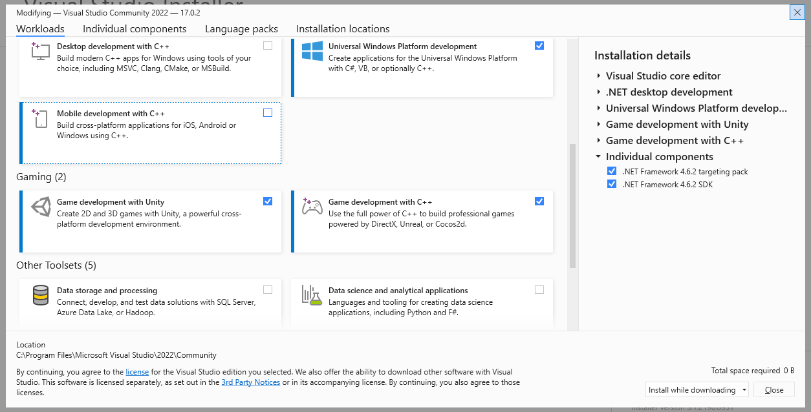
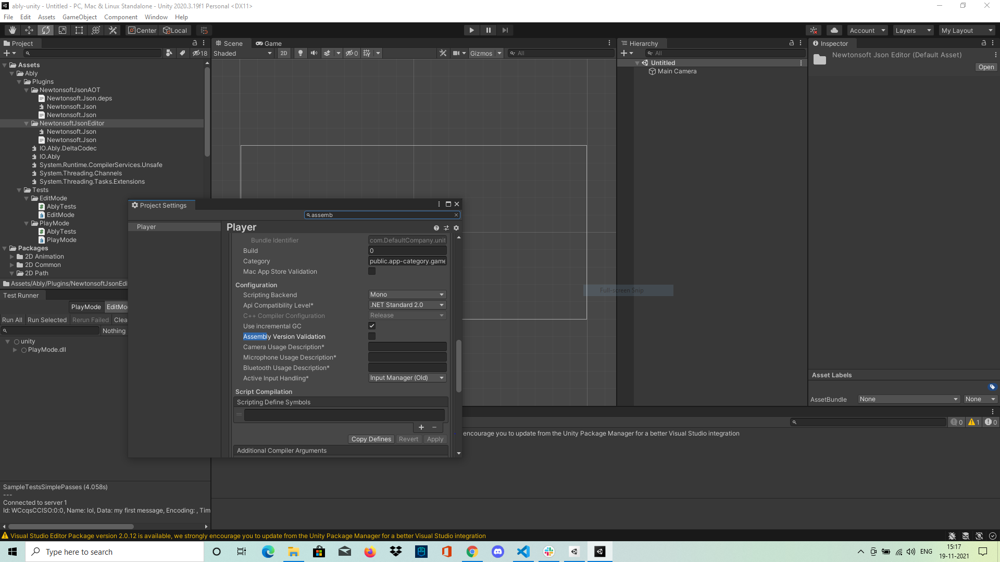

# **Dev Setup**
  Clone the `ably-dotnet` repo. and open `unity` folder. 

## **Requirements**
1. Git - VCS for ably-dotnet
2. Unity - Unity game engine (Currently using LTS 2020.3.19f1) 
3. Unity script editor - Visual studio (Official IDE)/ Visual studio code (Editor)/ Rider (Intellij IDE)
4. Basics of unity [Official Unity Manual](https://docs.unity3d.com/Manual/index.html) and [Unity Beginner Manual](https://docs.google.com/document/d/1TJSKoqsElTjnAVKy-nFcARGHthwv18PFdt8pnuorxvw/edit?usp=sharing)

## **Installation**
**1.** **Git -**
- Download and install git binary from https://git-scm.com/downloads
- Clone the code using `git clone https://github.com/ably/ably-dotnet`

**2.** **Unity -** 
- Install unity hub (https://unity3d.com/get-unity/download) to manage unity projects and different versions of unity
- Open unity hub after installation

1. Unity projects - 
- Unity projects are visible as a part of Unity Hub (list should be empty for none active projects)
  

- Please note, for each unity project, a specific unity version is specified, it can be changed by clicking on the visible version and selecting dropdown menu of installed unity versions.
  
2. Install specific unity version -   
- Click on the **Installs** menu-item from the left navigation bar to see the list of installed unity versions. In this image 2020.3.19f1 is installed, but the list will be empty if no versions are installed.


- Click the **ADD** button in the top-right corner to install a new version of unity.


- Select the most recent LTS version and click on **NEXT** to install the selected unity version.
- Once installed, it should appear under the `Installs` menu-item tab.

3. Install unity modules - 
- Unity modules are basically extra plugins to add build support for different platforms.
- Click on **`⋮`** to open the menu for installing modules.
  


- Click on the `Add Modules` option, to open the list of modules.

 
- Select `Windows Build Support (IL2CPP)` to add support for IL2CPP build support for Windows, then click on `DONE` to install the module.

- For more information related to Unity installation, please go through the [official documentation](https://docs.unity3d.com/Manual/UnityOverview.html) for [Installing Unity](https://docs.unity3d.com/Manual/GettingStartedInstallingUnity.html), [Unity Editor tabs/Windows](https://docs.unity3d.com/Manual/UsingTheEditor.html), [Editor features](https://docs.unity3d.com/Manual/EditorFeatures.html) and [Visual Studio Unity integration](https://docs.unity3d.com/Manual/VisualStudioIntegration.html).

**3.** **Visual Studio -**
- Visual studio community is free to use so it can be downloaded and installed using ***visual studio installer***.
- Download the official [visual studio installer](https://visualstudio.microsoft.com/downloads/) from https://visualstudio.microsoft.com/downloads/.
- ***Visual Studio installer*** is used to manage different versions of Visual Studio along with the necessary plugins and individual components for each version of Visual Studio. 
- Install and open the Visual Studio installer.

1. Install Visual Studio
- There are two tabs visible. One shows `Installed` Visual Studio versions and the other `Available` versions.

  
- If you have no versions installed, a new window will open showing visual studio components that need to be installed
- Under the 'Desktop and Mobile' header, click on `.NET desktop development` and ensure the checklist on the right nav bar match up to the below image.


- Next, click on 'Game development with Unity' for unity editor scripting support.


- In the `Individual components` tab on the right nav bar select the following components.

  
- Finally, click the 'modify' button on the bottom-right to install visual studio with selected components.
- You can follow https://www.youtube.com/watch?v=FBo5Cso-ufE for a more detailed guide on setting up Visual Studio for Unity.

2. Update/Repair/Modify installed visual studio
- If you need to change anything with Visual Studio, open the Visual Studio installer, where you should see the Visual Studio versions you have installed.


- Click on `Modify` on the version you wish to change the original component installation as below.


- Check the missing/broken components and click on `Modify` to install them again.

## **Setup** 
- After cloning this project, open the Unity Hub.


- Click on the `ADD` button and open this project under `ably-dotnet\unity`.
- The default project layout should look as below:
  
  
- The default layout displayed has the test runner missing. For a more optimized layout for development, we have a custom Unity layout found under `ably-dotnet\unity\unity_editor_layout.wlt`.
- To apply our custom layout, you can click the selector named `Default` in the top-right corner.
  
  
- Select `Load Layout From File` and choose the file `ably-dotnet\unity\unity_editor_layout.wlt`. The new layout should look like this:

  
- We now have a test runner window in the bottom-left along with a user-friendly editor layout.

### **Disable assembly validation error**
- Unity has a [`NewtonSoftJson`](https://docs.unity3d.com/Packages/com.unity.nuget.newtonsoft-json@3.0/manual/index.html) package used by default, which conflicts with the [`NewtonSoftJson.JSON.dll`](https://github.com/jilleJr/Newtonsoft.Json-for-Unity) included with the Ably plugin, resulting in assembly validation errors. To resolve this, we need to disable `Assembly Validation`.
- Go to `Edit -> Project Settings -> Player -> Assembly Version Validation`, uncheck the box, then click `Apply`.



## **[Running tests](https://docs.unity3d.com/Packages/com.unity.test-framework@1.1/manual/index.html)**

### Running EditMode tests

[Via GUI](https://docs.unity3d.com/Packages/com.unity.test-framework@1.1/manual/workflow-create-test.html) 
- In the bottom-left corner in the test runner window, click on the `EditMode` tab.
- All tests should be available and shown under `EditMode.dll`.
- Double click on `EditMode.dll` to run the tests or right-click and `Run` the tests.


[Via console](https://docs.unity3d.com/Packages/com.unity.test-framework@1.1/manual/reference-command-line.html)
```bash
Unity.exe -batchmode -nographics -runTests -projectPath 'C:\Users\${UserName}\UnityProjects\ably-unity' -testResults editmode-results.xml -testPlatform editmode
```

### Runing PlayMode tests
   
[Via GUI](https://docs.unity3d.com/Packages/com.unity.test-framework@1.1/manual/workflow-create-playmode-test.html)
- In the bottom-left corner of the test runner window, click on the `PlayMode` tab.
- All tests should be available and shown under `PlayMode.dll`.
- Double click on `PlayMode.dll` to run the tests or `right click` and `Run` the tests.

  

[Via console](https://docs.unity3d.com/Packages/com.unity.test-framework@1.1/manual/reference-command-line.html)
```bash
Unity.exe -batchmode -nographics -runTests -projectPath 'C:\Users\${UserName}\UnityProjects\ably-unity' -testResults playmode-results.xml -testPlatform playmode
```

## **Export unitypackage**
[Via GUI](https://docs.unity3d.com/Manual/AssetPackagesCreate.html) 
- Right click on `Assets` under the `project` window tab in the top-left corner.
- Click on `Export Package` -> `Export` to export the standalone unity package.


[Via Console](https://docs.unity3d.com/Manual/EditorCommandLineArguments.html) 
```bash
Unity.exe -batchmode -nographics -quit -projectPath 'C:\Users\${UserName}\UnityProjects\ably-unity' -exportPackage 'Assets' 'ably.unitypackage'
```
- More information relating to Asset Package Export and Import can be found in https://docs.unity3d.com/Manual/AssetPackages.html.

## **CI/CD for unity**
- Currently, CI/CD for Unity projects are available using [gameCI](https://game.ci/) (open source tool), [codemagic](https://unitycicd.com/) and [unity cloud build](https://unity.com/products/cloud-build).
- To use gameCI, follow the [gameCI GitHub actions documentation](https://game.ci/docs/github/getting-started).
- To use codemagic, follow the [CI for Unity games using codemagic](https://blog.codemagic.io/why-to-use-cicd-for-unity-games/) blog post and [getting started with Unity codemagic documentation](https://docs.codemagic.io/yaml-quick-start/building-a-unity-app/).
- Learn more about Unity Cloud Build [here](https://unity.com/products/unity-devops/pricing#cloud-build).

## Updating the Ably Unity Package
- Currently, the latest Ably source code is imported as DLLs in Unity using [Unity Plug-ins](https://docs.unity3d.com/Manual/Plugins.html).
- This is done as part of the [release process](../CONTRIBUTING.md/#release-process) by running `./unity-plugins-updater.sh 1.2.3` (linux/mac) / `.\unity-plugins-updater.cmd 1.2.3` (windows) at the root.
- This script is responsible for copying the latest `ably` and `deltacodec` release DLLs into `unity/Assets/Ably/Plugins/`.
- Other DLLs available under `unity/Assets/Ably/Plugins/` are dependencies of `ably` and `deltacodec`. 
- Those plugins need to be updated manually if the copies of  `ably` or `deltacodec` DLLs become incompatible with them.
 i.e. If versions of those dependencies are changed/updated using Nuget Package Manager.
