# **ably-unity**
  Ably `unity` project is under `ably-dotnet` folder. Use unity-hub to open the project with LTS unity version.

## **Requirements**
1. Git - VCS for ably-dotnet
2. Unity - Unity game engine (Currently using LTS 2020.3.19f1) 
3. Unity script editor - Visual studio (Official IDE)/ Visual studio code (Editor)/ Rider (Intellij IDE)

## **Installation**
**1.** **Git -**
- Download and install git binary from here https://git-scm.com/downloads (ignore if already installed)
- Clone the code using `git clone https://github.com/ably/ably-dotnet`
- 
**2.** **Unity -** 
- Install unity hub (https://unity3d.com/get-unity/download) to manage unity projects and different versions of unity
- Open unity hub after installation.

1. Unity projects - 
- Unity projects are visible as below as a part of Unity Hub (list should be empty for none active projects)
  
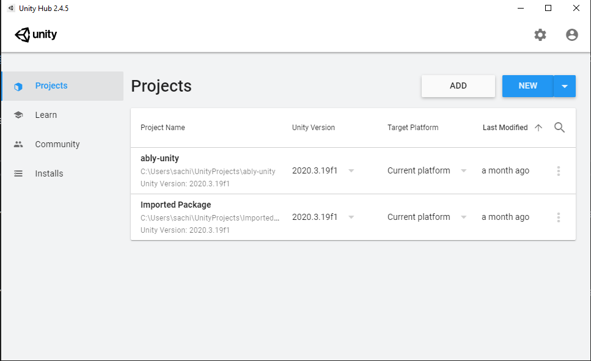
- Please note, for each unity project, a specific unity version is specified, it can be changed by clicking on the visible version and selecting dropdown menu of installed unity versions.
  
1. Install specific unity version -   
- Click on **Installs** menu-item from left navigation bar to see the list of installed unity versions. Currently 2020.3.19f1 is installed, list should be empty for none installed.

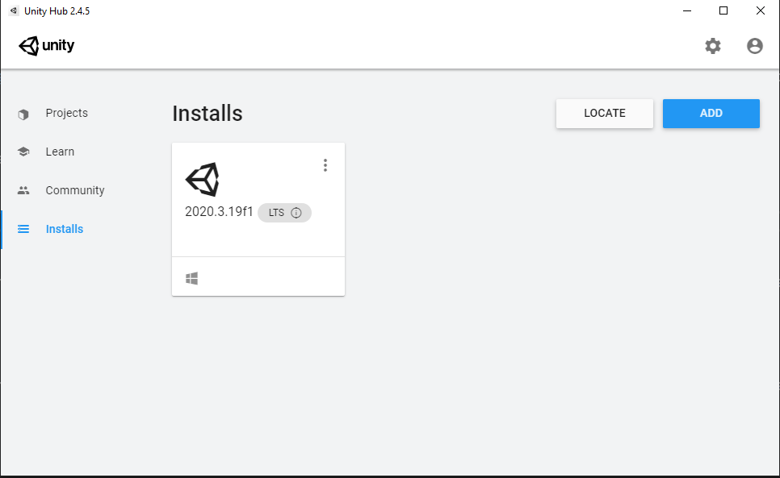
- Click on **ADD** button on the top-right corner to install new version of unity.

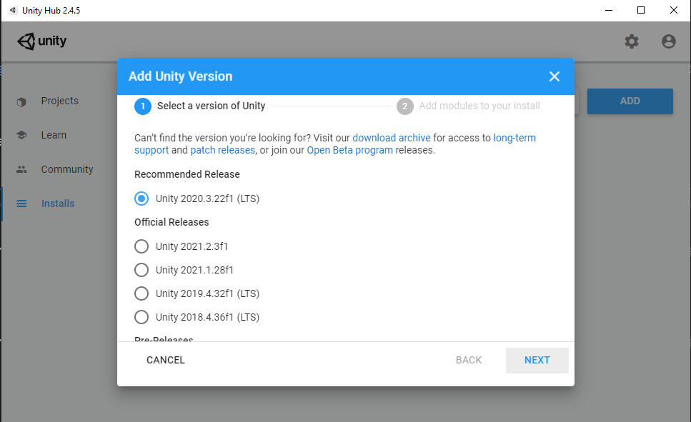
- Select most recent LTS version and click on next to install the selected unity version.
- Once installed, it should appear under `Installs` menu-item tab.

1. Install unity modules - 
- Unity modules are basically extra plugins to add build support for different platforms.
- Click on **`⋮`** to open menu for installing modules.
  


- Click on `Add Modules` option, to open list of modules
  
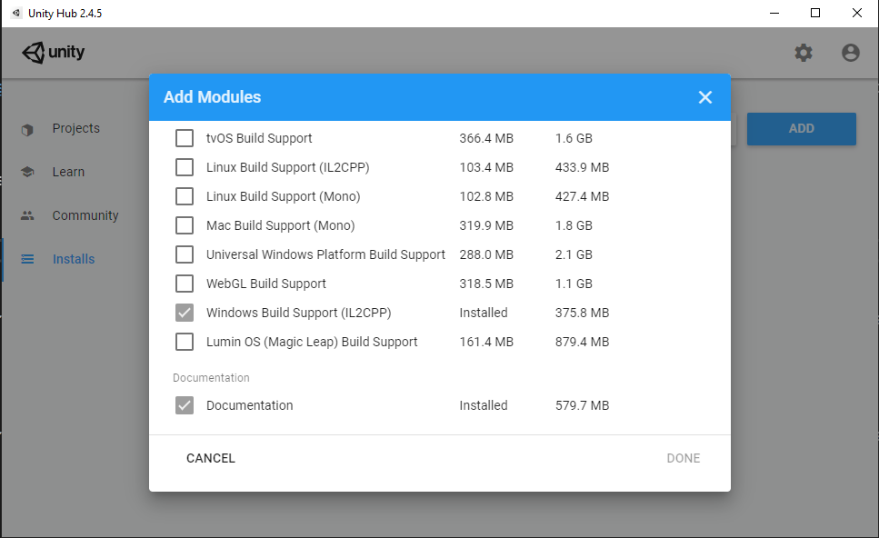 
- Select `Windows Build Support (IL2CPP)`  to add support for IL2CPP build support for windows, click on `DONE` to install the module

**3.** **Visual studio -**
- Visual studio community is free to use so it can be downloaded and installed using ***visual studio installer***.
- Install official visual studio installer from https://visualstudio.microsoft.com/downloads/.
- ***Visual studio installer*** is used to manage different versions of visual studio along with necessary plugins/individual components for each version of visual studio. 
- Install and open visual studio installer 

1. Install visual studio  
- Two tabs are visible showing `Installed` and `Available` Visual studio versions.

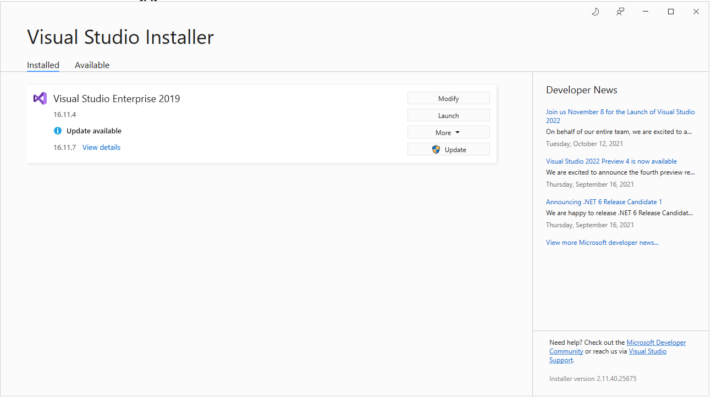  
- For none installed, it will open a new window showing visual studio components that needs to be installed
- Click on .Net Desktop development and check list of components on the right nav bar.

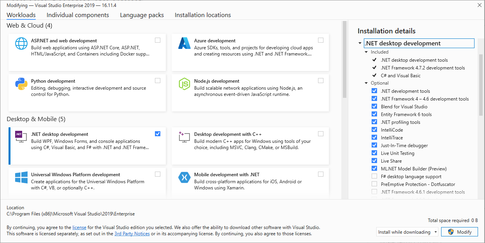

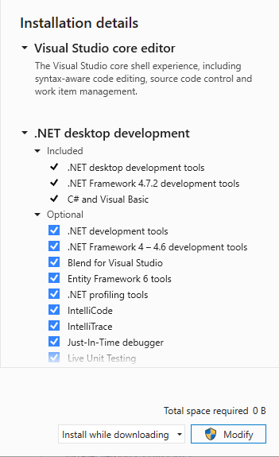
- Click on Game development with Unity for adding unity editor scripting support

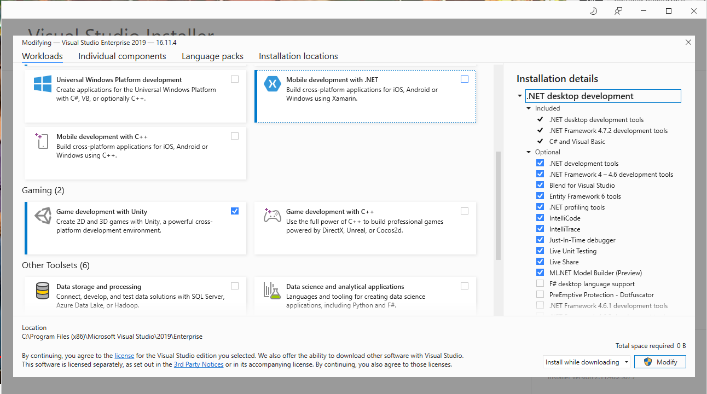
- Go to `Individual components` tab and select following components

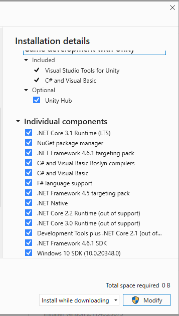  
- Click on modify button on the right-bottom to install visual studio
- Follow https://www.youtube.com/watch?v=FBo5Cso-ufE for detailed information on visual studio installation.

1. Update/Repair/Modify installed visual studio
- Open visual studio installer, it should show installed visual studio as below


- Click on `Modify` to open original component installation window as below.


- Check missing components and click on `Modify` to install them again.

## **Setup** 
- After cloning the project, open unity-hub.


- Click on `ADD` button and open project under `ably-dotnet\unity` 
- Default project layout should look as below
  
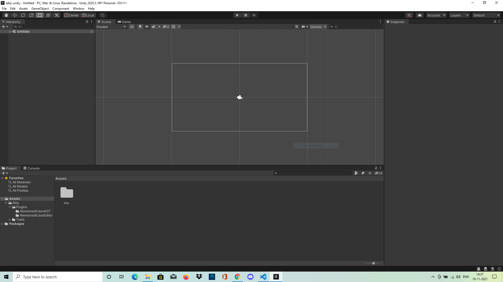  
- In current layout, test runner is missing. Default layout is not so user-friendly, so we need to change it as per requirement.
- Unity custom layout is provided under `ably-dotnet\unity\unity_layout.wlt`
- From the top-right corner, click selector named `Default`, it should show the menu to change the layout.
  
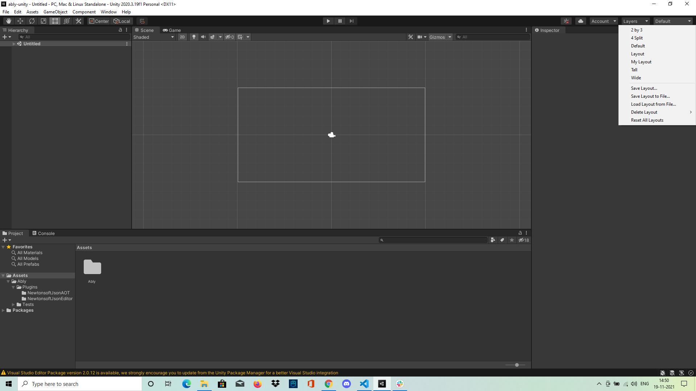  
- Select `Load Layout From File` and choose file under `ably-dotnet\unity\unity_layout.wlt`. New layout should look like this.

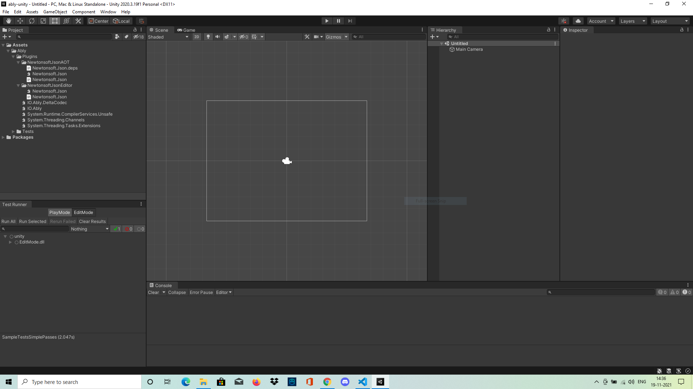  
- Now we have a test runner windows at bottom-left along with user-friendly editor layout.

### **Disable assembly validation error**
- Unity internally has `NewtonSoftJson` package with assembly naming conflicting with provided `NewtonSoftJson.JSON.dll`(https://github.com/jilleJr/Newtonsoft.Json-for-Unity) as a plugin.
- So, it gives assembly validation error in the console while building the project, to resolve issue, disable `Assembly Validation`
- Go to `Edit -> Project Settings -> Player -> Assembly Version Validation`, uncheck the box and click on apply.

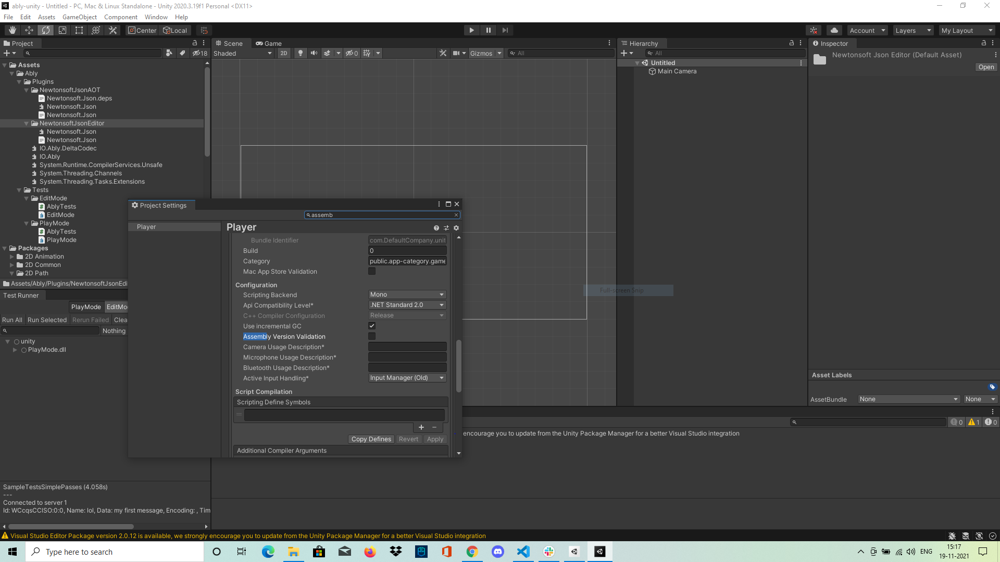

## **Running tests**

1. **Run editmode tests**

Via GUI 
- At the bottom-left corner in the test runner window, click on `EditMode` tab
- All the tests should be available and shown under `EditMode.dll`
- Double click on `EditMode.dll` to run the tests or `right click` and `Run` the tests


Via console
```bash
Unity.exe -batchmode -nographics -runTests -projectPath 'C:\Users\${UserName}\UnityProjects\ably-unity' -testResults editmode-results.xml -testPlatform editmode
```

1. **Run playmode tests**
   
Via GUI
- At the bottom-left corner in the test runner window, click on `PlayMode` tab
- All the tests should be available and shown under `PlayMode.dll`
- Double click on `PlayMode.dll` to run the tests or `right click` and `Run` the tests
  
Via console
```bash
Unity.exe -batchmode -nographics -runTests -projectPath 'C:\Users\${UserName}\UnityProjects\ably-unity' -testResults playmode-results.xml -testPlatform playmode
```

## **Export unitypackage**
Via GUI 
- Right click on `Assets` under `project` window tab at top-left corner.
- Click on `Export Package` -> `Export` to export the standalone unity package.

Via Console 
```bash
Unity.exe -batchmode -nographics -quit -projectPath 'C:\Users\${UserName}\UnityProjects\ably-unity' -exportPackage 'Assets' 'ably.unitypackage'
```