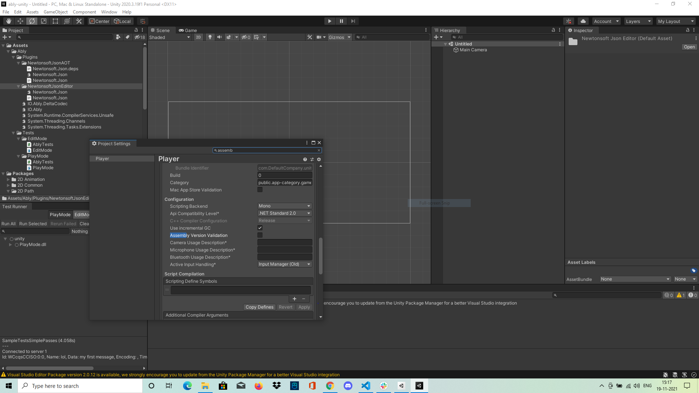

**Ably Unity**
- Ably unity project supports both Mono and IL2CPP builds.
- Follow `SETUP.md` doc for dev setup on the local.
  
### Downloading Unity Package
- Please download the latest Unity package from the GitHub releases page (https://github.com/ably/ably-dotnet/releases). All releases from 1.1.16 will include a Unity package as well.

### Importing Unity Package
- Import package as mentioned here https://docs.unity3d.com/Manual/AssetPackagesImport.html
- Make sure to disable assembly validation if it fails due to conflict with internal newtonsoft json library.

- NewtonSoft JSON DLL's can be removed, in case use of inbuilt Newtonsoft is preferred https://docs.unity3d.com/Packages/com.unity.nuget.newtonsoft-json@2.0/manual/index.html. 
  